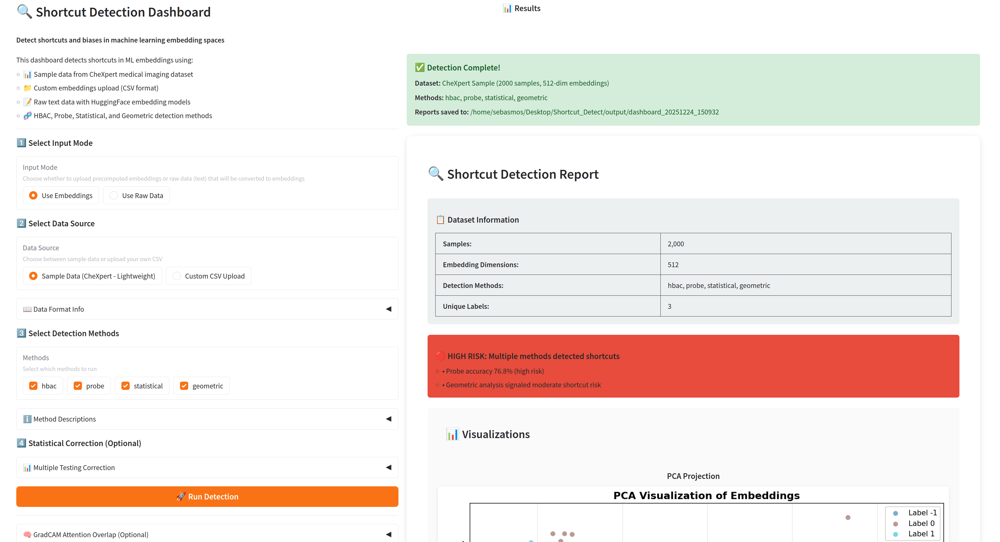

# Interactive Dashboard

ShortKit-ML includes an interactive Gradio web interface for visual exploration and analysis.

## Launching the Dashboard

```bash
# Ensure dashboard dependencies are installed
pip install "shortcut-detect[dashboard]"

# Launch the dashboard
python app.py
```

The dashboard opens at [http://127.0.0.1:7860](http://127.0.0.1:7860)

## Features

### Sample Data

The dashboard comes pre-loaded with **CheXpert medical imaging data**:

- 2,000 samples
- 512-dimensional embeddings
- Race-based demographic groups
- Ready for immediate exploration

### Custom Data Upload

Upload your own data as a CSV file:

```csv
embedding_0,embedding_1,embedding_2,...,task_label,group_label
0.123,0.456,0.789,...,1,group_a
0.234,0.567,0.890,...,0,group_b
...
```

**Requirements:**

- Columns named `embedding_0`, `embedding_1`, etc. for embedding dimensions
- Column named `task_label` for task labels (optional)
- Column named `group_label` for protected attribute labels
- Optional: `attr_<name>` columns (e.g., `attr_race`, `attr_gender`) for Causal Effect

### Detection Methods

Select which detection methods to run:

- **HBAC** - Clustering analysis
- **Probe** - Classifier-based detection
- **Statistical** - Hypothesis testing
- **Geometric** - Subspace analysis
- **Causal Effect** - Spurious attribute detection (requires `attr_*` columns)

### Visualizations

The dashboard provides interactive visualizations:

- **t-SNE/UMAP plots** - Embedding space visualization colored by group
- **Feature importance** - Which dimensions show group differences
- **Cluster dendrograms** - HBAC hierarchical structure
- **ROC curves** - Probe classifier performance

Advanced, optional tools (GradCAM attention overlap, GT mask overlap, SpRAy heatmap clustering, CAV concept testing, and VAE image shortcut detection) are available in the **Advanced Analysis** tab. You can also optionally include CAV in the main Detection report by uploading a concept bundle.

### Report Export

Export your analysis:

- **HTML Report** - Interactive report with all visualizations
- **PDF Report** - Printable summary document
- **CSV Export** - Raw results for further analysis (ZIP file)

## Configuration Options

### Method Parameters

| Parameter | Default | Description |
|-----------|---------|-------------|
| HBAC max iterations | 3 | Maximum clustering depth |
| HBAC min cluster size | 0.05 | Minimum cluster size as fraction |
| Probe model | Logistic Regression | Classifier for probe-based detection |
| Statistical test | Mann-Whitney U | Non-parametric test for group differences |
| Significance level | 0.05 | Alpha for statistical tests |
| Causal effect spurious threshold | 0.1 | Attributes with \|effect\| below this are flagged |
| CAV quality threshold | 0.7 | Minimum concept quality (AUC) |
| VAE latent dim | 10 | VAE latent dimension (Advanced Analysis) |

### Visualization Settings

| Setting | Default | Description |
|---------|---------|-------------|
| Dimensionality reduction | t-SNE | Method for 2D projection |
| Perplexity (t-SNE) | 30 | t-SNE perplexity parameter |
| n_neighbors (UMAP) | 15 | UMAP neighborhood size |
| Color palette | Categorical | Color scheme for groups |

## Keyboard Shortcuts

| Shortcut | Action |
|----------|--------|
| `Enter` | Run analysis |
| `Ctrl+S` | Download report |
| `Esc` | Cancel operation |

## Screenshot



## Troubleshooting

### Dashboard Won't Start

```bash
# Check Gradio is installed
python -c "import gradio; print(gradio.__version__)"

# Reinstall if needed
pip install --upgrade gradio
```

### Port Already in Use

```bash
# Use a different port
python app.py --port 7861
```

### Large File Upload Fails

The default upload limit is 100MB. For larger files:

```python
# In app.py, modify the launch command
demo.launch(max_file_size=500)  # 500MB limit
```

## Programmatic Access

You can also run the dashboard programmatically:

```python
from app import create_demo

# Create the Gradio demo
demo = create_demo()

# Launch with custom settings
demo.launch(
    server_name="0.0.0.0",  # Allow external access
    server_port=7860,
    share=True,  # Create public link
)
```

## Docker Deployment

```dockerfile
FROM python:3.10-slim

WORKDIR /app
COPY . .

RUN pip install -e ".[dashboard]"

EXPOSE 7860
CMD ["python", "app.py", "--host", "0.0.0.0"]
```

```bash
docker build -t shortcut-detect-dashboard .
docker run -p 7860:7860 shortcut-detect-dashboard
```

## Next Steps

- [Quick Start](quickstart.md) - Programmatic usage
- [Detection Methods](../methods/overview.md) - Understand each method
- [Examples](../examples/basic.md) - Jupyter notebooks
