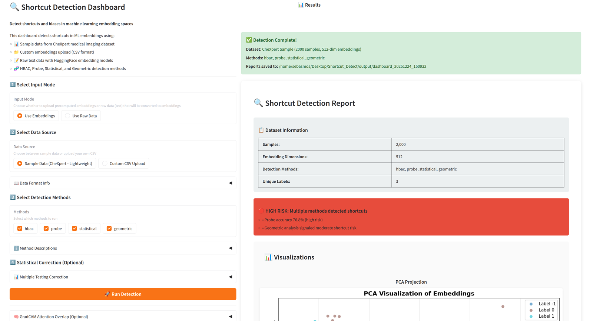

# Interactive dashboard

ShortKit-ML ships a Gradio web interface. Its first tab, **Audit**, runs the audit of the ShortKit-ML paper on your embeddings and writes the report. The other tabs (Detection, Model Comparison, Advanced Analysis) are the exploratory detector suite described further down.

## Launching the dashboard

```bash
# From a source checkout; Gradio is part of the base install
uv pip install -e .

# Launch the dashboard
python app.py
```

The dashboard opens at [http://127.0.0.1:7860](http://127.0.0.1:7860)

## The Audit tab

The Audit tab asks the question of the ShortKit-ML paper: does the embedding carry the attribute beyond what the task label explains? It calls `shortcut_detect.audit.conditional_audit` with the settings you enter, so the result is the same one `examples/walkthrough/03_run_the_audit.py` prints, with a mouse instead of a script.

<video autoplay muted loop playsinline controls preload="metadata" poster="../../assets/walkthrough/dashboard-audit-poster.jpg" src="../../assets/walkthrough/dashboard-audit.mp4"></video>

Captions are burned into the video; the audit's wait is cut from the recording.

**What it takes**

- **Embeddings**: a `.npy` array of shape `(n, d)`, or a CSV with `embedding_0`, `embedding_1`, ... columns (any numeric columns are used when none start with `embedding_`).
- **Labels CSV**: one row per embedding, in the same order. Name the **attribute column** and the **task column** in the two boxes; a **groups column** is optional (a unit id per row, such as a patient or identity, kept whole in folds and permutations). Leave the labels file empty when the embeddings CSV already holds the label columns; the defaults, `group_label` and `task_label`, match the CSV convention of the Detection tab.
- **Settings**: permutations K (200), probe permutations (500) and seed (42) are the paper's budget. Lower K for a quick look: 1500 CelebA embeddings at K = 100/200 take about half a minute on a laptop CPU, longer when the machine is busy. The two name boxes only change how the attribute and task are called in the summary and the report.
- **Load CelebA sample (1500 images)** fills every input from `data/celeba` (ResNet-50 embeddings, attribute `Male`, task `Blond_Hair`; `scripts/setup_celeba_data.py` downloads them). Without those files it loads a synthetic set of 1500 embeddings with an attribute signal planted in the first four dimensions, and says so in the status line.

**What it shows**

- A plain-language summary: the conditional probe's out-of-fold AUROC with its 95% interval, the permutation null's mean and SD, the permutation p-value and the decision at alpha = 0.05.
- The detector table from `AuditResult.rows()`: statistic, interval, null mean and SD, p, Benjamini-Hochberg q and flag for the probe and the five secondary detectors (statistical, geometric, bias direction, HBAC NMI, frequency top-k). The probe decides; the other five describe and do not change the decision.
- The six-panel figure: each detector's observed statistic (dot) against its null band (mean plus or minus 2 SD), red when flagged.
- **HTML report** and **PDF report** downloads, both written by `shortcut_detect.audit.report.audit_report`, the same files `examples/walkthrough/05_report.py` produces.

The callback behind the Run button is a plain function, `run_audit_tab(...)` in `app.py`, so the same inputs can be run without Gradio (see `tests/test_dashboard.py`).

## Exploratory tabs

The remaining tabs run the older `ShortcutDetector` suite with risk levels and an aggregation condition. They are exploratory: their thresholds and risk levels are heuristics for looking at an embedding space, and none of them decide anything in the ShortKit-ML paper, whose decision rule is the Audit tab's conditional probe.

### Sample data

The default data source of the Detection tab is **Sample Data (CheXpert - Lightweight)**:

- 2,000 rows drawn at random (`random_state=42`) from the CheXpert `train.csv`, with real metadata and demographics when Stanford's `train.csv` (and `CHEXPERT DEMO.xlsx`) are in `data/`; without them, 2,000 rows of synthetic metadata (sex, race, a Cardiomegaly label) are generated and the run is labelled "synthetic metadata"
- 512-dimensional **synthetic** embeddings generated over that metadata (the first 10 dimensions carry a planted shortcut)
- Race groups (WHITE, BLACK/AFRICAN AMERICAN, ASIAN, OTHER) from the demographics file
- Tick **Use real CheXpert embeddings** to load `data/chest_embeddings.npy`, `chest_labels.npy` and `chest_group_labels.npy` instead, when they exist

These sample embeddings are not the arrays used in the paper; those are on the gated Hugging Face dataset described in [Reproducing the Paper](../reproducibility.md).

### Raw text mode

With **Input Mode** set to *Use Raw Data*, upload a CSV with a `text` column and name a HuggingFace model (for example `sentence-transformers/all-MiniLM-L6-v2`); the dashboard embeds the text before running detection. This needs the `hf` extra (`uv pip install -e ".[hf]"`), which pins `transformers>=4.39,<5`.

### Custom data upload

Upload your own data as a CSV file:

```csv
embedding_0,embedding_1,embedding_2,...,task_label,group_label
0.123,0.456,0.789,...,1,group_a
0.234,0.567,0.890,...,0,group_b
...
```

**Requirements:**

- Columns named `embedding_0`, `embedding_1`, etc. for embedding dimensions
- Column named `task_label` for task labels (optional)
- Column named `group_label` for protected attribute labels
- Optional: `attr_<name>` columns (e.g., `attr_race`, `attr_gender`) for Causal Effect

### Detection methods

`shortcut_detect/discovery.py` registers 19 detection methods. The **Detection** tab's checklist shows sixteen of them (the first ten are selected by default); the other three, CAV, GradCAM mask overlap and VAE, run from the CAV concept-bundle accordion and the Advanced Analysis tab:

- **HBAC** - Clustering analysis
- **Probe** - Classifier-based detection
- **Statistical** - Hypothesis testing
- **Geometric** - Subspace analysis
- **Equalized Odds** - TPR/FPR gaps across groups
- **GroupDRO** - Worst-group robustness
- **Demographic Parity** - Positive rate gaps across groups
- **Intersectional** - Gaps across intersections of attributes (needs two or more attributes: `attr_*` columns, or `group_label` plus one `attr_*`)
- **Bias Direction PCA** - Projection gap along the bias direction
- **Early-Epoch Clustering (SPARE)** - Clusters of early-epoch representations
- **GCE** - High-loss minority samples
- **SIS** - Sufficient input subsets
- **SSA** - Spread Spurious Attribute; the dashboard builds the labelled/unlabelled split (see *SSA Settings*)
- **Causal Effect** - Spurious attribute detection (requires `attr_*` columns)
- **Frequency** - Signal concentrated in few dimensions
- **Generative CVAE** - Counterfactual embedding shifts

An **Overall Assessment Condition** dropdown picks how method results are aggregated (`indicator_count` by default), and a **Multiple Testing Correction** accordion sets the correction for the statistical test. These risk levels and conditions are the interactive detector's heuristics; the paper's audit (`shortcut_detect.audit.conditional_audit`, the Audit tab) uses the conditional probe with a permutation null instead, and none of the thresholds here decide anything in the paper.

**Run Detection** fits the selected methods and renders the results panel. Methods that fail or are skipped are listed in a *method(s) did not run* box with the error, rather than dropped silently. The HTML report includes a section per method, among them SSA and Generative CVAE sections when those methods ran.

### Visualizations

The HTML report embeds PCA and t-SNE projections coloured by group, a 3D projection, dimension-importance and p-value heatmaps from the statistical test, and HBAC cluster purities.

### Model comparison

The **Model Comparison** tab runs the same methods on two or more embedding sets (several CSVs, or several HuggingFace models over one raw-text CSV) and reports them side by side (**Run Comparison**).

### Advanced analysis

The **Advanced Analysis** tab holds optional tools that do not need a detection run first. Each accordion has one button:

| Accordion | Button | What it does |
|-----------|--------|--------------|
| GradCAM Attention Overlap | Generate GradCAM Heatmaps | Heatmaps for uploaded images and a torch model |
| GradCAM GT Mask Overlap | Run Mask Overlap | Overlap between heatmaps and ground-truth masks |
| SpRAy Heatmap Clustering | Run SpRAy Clustering | Spectral clustering of heatmaps |
| CAV Concept Testing | Run CAV Analysis | Concept activation vectors from a concept bundle |
| VAE Image Shortcut Detection | Run VAE Analysis | VAE latent disentanglement on images |
| Shortcut Feature Masking (M01) | Run Shortcut Masking | Mask or inpaint image regions, or zero/randomise embedding dimensions |
| Background Randomization (M02) | Run Background Randomization | Swap foregrounds across backgrounds |
| Adversarial Debiasing (M04) | Run Adversarial Debiasing | Gradient-reversal encoder; returns debiased embeddings as CSV |
| Last Layer Retraining (M06 DFR) | Run Last Layer Retraining | Refits an L1 logistic head (C and penalty adjustable) on a subset balanced over attribute x task label groups (2A+Y), as in the paper; returns `dfr_prediction` |
| Contrastive Debiasing (M07 CNC) | Run Contrastive Debiasing | Positives are same task, other group; negatives other task; returns debiased embeddings |
| Explanation Regularization (M05 RRR) | Run Explanation Regularization | Penalises input gradients on shortcut regions; needs a model and images |

The three embedding-level mitigations and DFR can read the embeddings exported by the last detection run (*Use embeddings from last detection run*) or an uploaded CSV with `task_label` and a group column. You can also include CAV in the main Detection report by uploading a concept bundle.

### Report export

Export your analysis:

- **HTML Report** - Interactive report with all visualizations
- **PDF Report** - Printable summary document
- **CSV Export** - Raw results for further analysis (ZIP file)

## Configuration options

### Method parameters

These are the controls exposed in the Detection tab's accordions; HBAC, Probe, Statistical and Geometric run with their package defaults and have no dashboard controls.

| Parameter | Default | Description |
|-----------|---------|-------------|
| Significance level (alpha) | 0.05 | Alpha for the statistical test (0.01 to 0.10) |
| Correction method | `fdr_bh` | Multiple testing correction: `fdr_bh`, `bonferroni`, `holm`, `fdr_by` |
| SSA labeled fraction | 0.2 | Portion of samples treated as labeled for SSA (plus a split seed, 42) |
| Frequency top percent / TPR / FPR | 0.05 / 0.5 / 0.15 | Dimension share kept and per-class flagging thresholds; probe evaluation on `train` |
| Early-epoch clustering min cluster ratio | 0.10 | SPARE minimum cluster ratio |
| GCE q / loss percentile / max iterations | 0.7 / 90 / 500 | Generalized cross-entropy settings |
| Causal effect spurious threshold | 0.1 | Attributes with \|effect\| below this are flagged |
| CAV concept quality threshold | 0.7 | Minimum concept AUC (Detection tab bundle and Advanced Analysis) |
| VAE latent dimension | 10 | Advanced Analysis |

Projections in the report (PCA, t-SNE, 3D) use fixed settings; there are no visualization controls in the dashboard.

## Screenshot



## Troubleshooting

### Dashboard won't start

```bash
# Check Gradio is installed
python -c "import gradio; print(gradio.__version__)"

# Reinstall if needed
pip install --upgrade gradio
```

### Port already in use

The app picks the first free port from 7860 upwards. To force one:

```bash
GRADIO_SERVER_PORT=7861 python app.py
```

## Programmatic access

`app.py` builds a `gr.Blocks` object named `demo` at import time and launches it only under `if __name__ == "__main__":`

```python
from app import demo

demo.launch(
    server_name="0.0.0.0",  # Allow external access
    server_port=7860,
    share=True,  # Create public link
)
```

## Docker deployment

```dockerfile
FROM python:3.10-slim

WORKDIR /app
COPY . .

RUN pip install -e ".[dashboard]"

EXPOSE 7860
CMD ["python", "app.py"]
```

```bash
docker build -t shortcut-detect-dashboard .
docker run -p 7860:7860 shortcut-detect-dashboard
```

## Next steps

- [Walkthrough](walkthrough.md) - The same audit as scripts, step by step
- [Quick start](quickstart.md) - Programmatic usage
- [Detection methods](../methods/overview.md) - Understand each method
- [Examples](../examples/basic.md) - Jupyter notebooks
