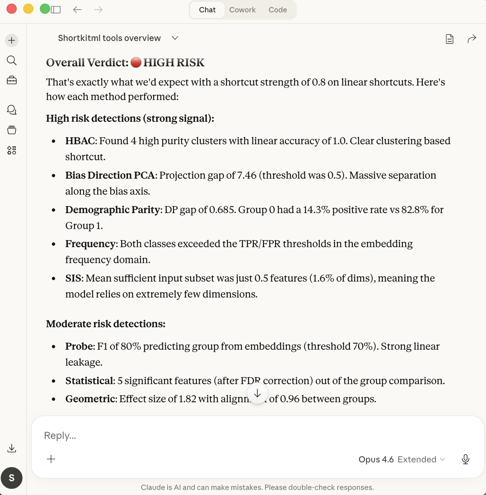

# MCP Server

ShortKit-ML ships a [Model Context Protocol (MCP)](https://modelcontextprotocol.io/) server that exposes shortcut detection as callable tools. AI assistants like Claude can run full analyses — generate data, run detectors, compare methods — directly from chat, with no Python script required.

## Prerequisites

Install the `mcp` extra into the project `.venv`:

```bash
uv pip install -e ".[mcp]"
```

Verify it works:

```bash
uv run python -m shortcut_detect.mcp_server
```

The server should start without errors. Press `Ctrl+C` to stop it.

---

## Option 1 — Claude Code (recommended)

Claude Code reads a `.mcp.json` file from the project root. This file is already committed to the repo, so no manual setup is needed after installing the package.

### Register the server

```bash
claude mcp add --scope project shortkit-ml .venv/bin/python -- -m shortcut_detect.mcp_server
```

This creates/updates `.mcp.json` in the repo root with:

```json
{
  "mcpServers": {
    "shortkit-ml": {
      "type": "stdio",
      "command": ".venv/bin/python",
      "args": ["-m", "shortcut_detect.mcp_server"]
    }
  }
}
```

### Verify

```bash
claude mcp list
```

Expected output:

```
shortkit-ml: .venv/bin/python -m shortcut_detect.mcp_server - ✓ Connected
```

The `shortkit-ml` tools are now available in any Claude Code session opened from this repo.

---

## Option 2 — Claude Desktop (macOS)

Claude Desktop requires manual configuration because it does not inherit your shell's `PATH`.

### 1. Find your `.venv` Python path

```bash
echo $(pwd)/.venv/bin/python
# e.g. /Users/yourname/ShortKit-ML/.venv/bin/python
```

### 2. Edit the config file

Open `~/Library/Application Support/Claude/claude_desktop_config.json` and add the `mcpServers` block:

```json
{
  "mcpServers": {
    "shortkit-ml": {
      "command": "/Users/yourname/ShortKit-ML/.venv/bin/python",
      "args": ["-m", "shortcut_detect.mcp_server"],
      "cwd": "/Users/yourname/ShortKit-ML"
    }
  }
}
```

Replace `/Users/yourname/ShortKit-ML` with your actual repo path.

### 3. Restart Claude Desktop

After restarting, the `shortkit-ml` tools will appear in the tools panel.

### Demo

Once connected, you can run all 19 detection methods on synthetic data directly from chat:



*Claude Desktop running all 19 ShortKit-ML methods on a synthetic dataset — overall verdict: HIGH RISK, with HBAC, Bias Direction PCA, Demographic Parity, Frequency, and SIS all flagging strong shortcut signals.*

### Common errors

| Error | Cause | Fix |
|-------|-------|-----|
| `Server disconnected` | Bare `uv` or `python` used as command | Use the full `.venv/bin/python` path |
| `ModuleNotFoundError: No module named 'mcp'` | `mcp` not installed in `.venv` | Run `uv pip install -e ".[mcp]"` |
| `ModuleNotFoundError: No module named 'shortcut_detect'` | `uv run` used as command — picks its own managed Python, not `.venv` | Use `.venv/bin/python` directly |

> **Why not `uv run`?** Claude Desktop spawns the command with a restricted `PATH`. `uv run` ignores the project `.venv` and falls back to its own managed Python interpreter, where `shortcut_detect` is not installed.

---

## Quick start — how to use the tools

Once connected, the tools are **automatic** — Claude calls them for you based on what you ask. You never invoke them by name. Just describe what you want in plain English.

To force Claude to use a specific tool, mention the action explicitly in your prompt (e.g. *"use the detector"*, *"generate synthetic data"*, *"compare methods"*).

### Copy-paste prompts

**See what's available**
```
List all available ShortKit-ML detection methods with descriptions.
```

**Generate synthetic data + run detection**
```
Generate 200 synthetic samples with a linear shortcut (strength 0.8) and run all 19 detection methods on them.
```

**Run on your own embeddings (inline)**
```
Run the ShortKit-ML detector on these embeddings: [[0.1, 0.2], [0.3, 0.4], ...]
with labels [0, 1, ...] and group_labels [0, 1, ...] using methods probe, statistical, and hbac.
```

**Run on your own embeddings (file)**
```
Run the ShortKit-ML detector on my embeddings at data/embeddings.npy with labels at data/labels.npy and group labels at data/group_labels.npy.
```

**Compare methods side by side**
```
Generate 300 nonlinear shortcut samples and compare all default methods. Which ones agree?
```

**Get a detailed summary**
```
Get the full summary for the last detector run.
```

**Drill into one method**
```
Show me the full raw results for the hbac method from the last run.
```

**Run the benchmark grid**
```
Run the full ShortKit-ML synthetic benchmark and show me the results.
```

**Generate a report**
```
Generate an HTML report for the last detector run and give me the file path.
```

---

## Available tools

| Tool | Description |
|------|-------------|
| `list_methods` | Returns all 19 detection methods with descriptions |
| `generate_synthetic_data` | Generates a synthetic shortcut dataset (linear / nonlinear / none, configurable strength) |
| `run_detector` | Runs selected methods on embeddings — returns verdict, risk level, per-method breakdown |
| `get_summary` | Human-readable summary from a prior `run_detector` call |
| `get_method_detail` | Full raw result dict for a single method |
| `compare_methods` | Side-by-side comparison table + consensus vote across methods |
| `run_benchmark` | Triggers the full synthetic benchmark grid via `BenchmarkRunner` |
| `generate_report` | Generates an HTML/PDF report and returns the file path + base64 blob |

### Example session

```python
# From Claude chat — no code needed, just describe what you want:
# "Generate 200 linear shortcut samples, run probe + statistical + hbac, and compare"

# Behind the scenes Claude calls:
generate_synthetic_data(n_samples=200, shortcut_type="linear")
run_detector(embeddings=..., labels=..., group_labels=..., methods=["probe", "statistical", "hbac"])
compare_methods(embeddings=..., labels=..., group_labels=...)
```

### File-based input

For large embeddings that can't be serialized inline, pass file paths instead:

```
Run the detector on my embeddings at ~/data/embeddings.npy with labels at ~/data/labels.npy
```

Supported formats: `.npy`, `.npz`, `.csv`, `.tsv`, `.txt`.

---

## Session persistence

Results are cached to `~/.cache/shortkit-ml-mcp/` via `joblib` and survive server restarts. Each MCP client gets an isolated session — concurrent users cannot overwrite each other's results.

To reuse a previous run:

```
Get the summary for session_id "my-run-1"
```
