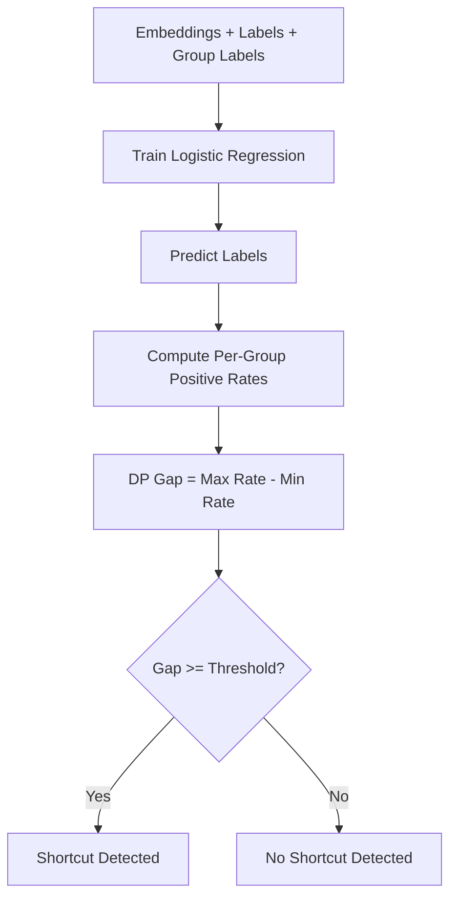

# Demographic Parity Detector

**Demographic Parity** measures the difference in positive prediction rates across demographic groups. A large gap indicates that the model's predictions depend on group membership, which may signal shortcut reliance on protected or spurious attributes.

## How It Works

1. **Train a logistic regression probe** on embeddings vs. task labels
2. **Predict labels** using the trained probe
3. **Compute positive prediction rates** per demographic group
4. **Calculate the DP gap**: max rate minus min rate across groups
5. **Assess risk** by comparing the gap to a configurable threshold



## Basic Usage

```python
from shortcut_detect.fairness import DemographicParityDetector

detector = DemographicParityDetector(
    dp_gap_threshold=0.1,
    min_group_size=10,
)

detector.fit(embeddings, labels, group_labels=group_labels)
report = detector.get_report()

print(f"Shortcut detected: {report['shortcut_detected']}")
print(f"Risk level: {report['risk_level']}")
print(f"DP gap: {report['metrics']['dp_gap']:.3f}")
```

## Parameters

| Parameter | Type | Default | Description |
|-----------|------|---------|-------------|
| `estimator` | LogisticRegression | None | Optional sklearn classifier (default: LogisticRegression with max_iter=1000) |
| `min_group_size` | int | 10 | Minimum group size; smaller groups get NaN rates |
| `dp_gap_threshold` | float | 0.1 | Gap threshold for flagging shortcut risk |

## Outputs

### Report Structure

| Field | Type | Description |
|-------|------|-------------|
| `shortcut_detected` | bool | Whether the DP gap exceeds the threshold |
| `risk_level` | str | "low", "moderate", "high", or "unknown" |
| `metrics.dp_gap` | float | Max minus min positive prediction rate across groups |
| `metrics.overall_positive_rate` | float | Overall positive prediction rate |
| `report.group_rates` | dict | Per-group positive rate and support |

### Interpretation

| Risk Level | Condition |
|------------|-----------|
| **Low** | DP gap < threshold |
| **Moderate** | DP gap >= threshold |
| **High** | DP gap >= 2x threshold |
| **Unknown** | Insufficient data to assess |

## Example with Synthetic Data

```python
import numpy as np
from shortcut_detect.fairness import DemographicParityDetector

rng = np.random.default_rng(42)
n = 400

# Two demographic groups with different embedding distributions
embeddings = rng.standard_normal((n, 16))
labels = np.array([0] * 200 + [1] * 200)
group_labels = np.array([0] * 100 + [1] * 100 + [0] * 100 + [1] * 100)

# Inject bias: group 1 has a spurious signal correlated with label
embeddings[100:200, 0] += 2.0
embeddings[300:400, 0] += 2.0

detector = DemographicParityDetector(dp_gap_threshold=0.1)
detector.fit(embeddings, labels, group_labels=group_labels)

report = detector.get_report()
print(f"Shortcut detected: {report['shortcut_detected']}")
print(f"DP gap: {report['metrics']['dp_gap']:.3f}")
```

## Unified API Integration

```python
from shortcut_detect import ShortcutDetector

detector = ShortcutDetector(
    methods=["demographic_parity"],
    seed=42,
)
detector.fit(embeddings, labels, group_labels=group_labels)
print(detector.summary())
```

## When to Use

**Use Demographic Parity Detector when:**

- You have demographic or protected group labels
- You want to measure fairness of predictions across groups
- You need a standard fairness metric (Feldman et al. 2015)
- Your task has binary labels

**Don't use Demographic Parity Detector when:**

- You do not have group labels (use GCE or Probe-based detection instead)
- Your task has more than two classes (requires binary labels)
- Groups are too small (fewer than `min_group_size` samples each)

## Theory

Demographic parity requires that the positive prediction rate is equal across groups:

$$P(\hat{Y} = 1 \mid G = g) = P(\hat{Y} = 1) \quad \forall g$$

The DP gap measures the maximum deviation:

$$\text{DP Gap} = \max_g P(\hat{Y}=1 \mid G=g) - \min_g P(\hat{Y}=1 \mid G=g)$$

A large DP gap suggests the model's predictions are influenced by group membership, potentially through shortcut features correlated with the protected attribute.

**Reference:** Feldman et al. 2015, "Certifying and Removing Disparate Impact."

## See Also

- [Equalized Odds](equalized-odds.md) - Complementary fairness metric
- [GCE Detector](gce.md) - Sample-level minority detection
- [API Reference](../api/demographic-parity.md) - Full API documentation
- [Overview](overview.md) - Compare all methods
