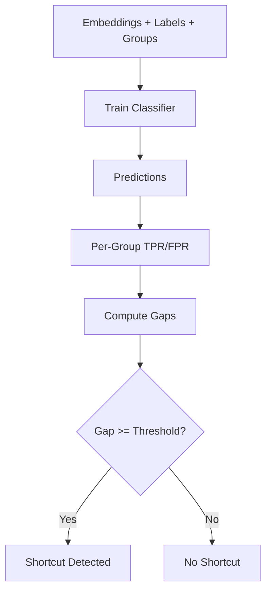

# Equalized Odds (Fairness Analysis)

**Equalized Odds** detects shortcuts by measuring **True Positive Rate (TPR) and False Positive Rate (FPR) disparities across protected groups**.

Based on [Hardt et al. (2016)](https://arxiv.org/abs/1610.02413), this method checks whether a classifier trained on embeddings satisfies the equalized odds criterion: equal TPR and FPR across all demographic groups.

Large gaps indicate that the embeddings encode **group-dependent shortcuts** that cause differential performance.

---

## How It Works

The Equalized Odds detector:

1. **Trains a lightweight classifier** (LogisticRegression by default) on embeddings to predict task labels
2. **Computes per-group metrics**: TPR and FPR for each protected group
3. **Calculates gaps**: `gap = max(rate) - min(rate)` across groups
4. **Assesses risk** based on gap thresholds



**Key insight**: If TPR or FPR differs significantly across groups, the model treats groups unequally for the same ground truth, suggesting shortcut reliance.

---

## Basic Usage

### Via the Unified API (Recommended)

```python
from shortcut_detect import ShortcutDetector
import numpy as np

# Precomputed embeddings
embeddings = np.load("embeddings.npy")
labels = np.load("labels.npy")  # Binary labels required
group_labels = np.load("groups.npy")  # Required

detector = ShortcutDetector(methods=["equalized_odds"])
detector.fit(embeddings, labels, group_labels=group_labels)

print(detector.summary())
```

### Standalone Usage

```python
from shortcut_detect.fairness import EqualizedOddsDetector

detector = EqualizedOddsDetector(
    tpr_gap_threshold=0.1,
    fpr_gap_threshold=0.1,
    min_group_size=10,
)

detector.fit(embeddings, labels, group_labels)

print(f"TPR Gap: {detector.tpr_gap_:.3f}")
print(f"FPR Gap: {detector.fpr_gap_:.3f}")
print(f"Risk Level: {detector.report_.risk_level}")
```

---

## Parameters

| Parameter | Type | Default | Description |
|-----------|------|---------|-------------|
| `estimator` | Estimator | LogisticRegression | Classifier to train on embeddings |
| `min_group_size` | int | 10 | Minimum samples per group (smaller groups get NaN) |
| `tpr_gap_threshold` | float | 0.1 | Threshold for flagging TPR disparity |
| `fpr_gap_threshold` | float | 0.1 | Threshold for flagging FPR disparity |

---

## Outputs

### Report Structure

`results_["equalized_odds"]["report"]` contains an `EqualizedOddsReport`:

| Field | Type | Description |
|-------|------|-------------|
| `group_metrics` | dict | Per-group TPR, FPR, support, and confusion matrix counts |
| `tpr_gap` | float | Max TPR - Min TPR across groups |
| `fpr_gap` | float | Max FPR - Min FPR across groups |
| `overall_accuracy` | float | Classifier accuracy on all samples |
| `risk_level` | str | "low", "moderate", or "high" |
| `notes` | str | Human-readable interpretation |
| `reference` | str | "Hardt et al. 2016" |

### Per-Group Metrics

For each group, `group_metrics[group_id]` contains:

| Metric | Description |
|--------|-------------|
| `tpr` | True Positive Rate = TP / (TP + FN) |
| `fpr` | False Positive Rate = FP / (FP + TN) |
| `support` | Number of samples in the group |
| `tp`, `fp`, `tn`, `fn` | Confusion matrix counts |

---

## Interpretation

### Risk Assessment

| Risk Level | Condition | Interpretation |
|------------|-----------|----------------|
| **Low** | Both gaps < threshold | Equalized odds approximately satisfied |
| **Moderate** | Any gap >= threshold | Noticeable disparity in TPR or FPR |
| **High** | Any gap >= 2x threshold | Large disparity, strong evidence of shortcuts |

### What the Metrics Mean

| Pattern | Interpretation |
|---------|----------------|
| High TPR gap | Model catches positives better for some groups than others |
| High FPR gap | Model makes more false alarms for some groups |
| Both gaps high | Systematic unfairness across both error types |
| Low accuracy + low gaps | Fair but poorly performing model |

**Rule of thumb**

> If TPR or FPR differs by more than 10% across groups, the embeddings likely encode shortcuts correlated with group membership.

---

## Example with Synthetic Data

```python
from shortcut_detect import ShortcutDetector
import numpy as np

np.random.seed(42)

# Create embeddings where group 0 has stronger signal
n = 500
embeddings = np.random.randn(n, 20)
labels = (embeddings[:, 0] > 0).astype(int)
groups = np.array([0] * 250 + [1] * 250)

# Add shortcut: group 1 has noisier signal
embeddings[250:, 0] += np.random.randn(250) * 2

detector = ShortcutDetector(methods=["equalized_odds"])
detector.fit(embeddings, labels, group_labels=groups)

print(detector.summary())
```

Expected: Higher TPR/FPR gaps due to differential signal quality across groups.

---

## When to Use Equalized Odds

**Use Equalized Odds when:**

- You have **binary task labels** (required)
- You have **explicit group labels** (demographics, environments)
- You want **interpretable fairness metrics**
- You need to report **regulatory fairness compliance**
- You want to measure **differential error rates** across groups

**Don't use Equalized Odds when:**

- Labels are multi-class (use other methods)
- Group labels are unavailable
- You want unsupervised detection (use HBAC, Geometric)
- Groups are too small (< 10 samples each)

---

## Theory

Equalized Odds (Hardt et al., 2016) requires:

$$
P(\hat{Y}=1 | Y=y, A=a) = P(\hat{Y}=1 | Y=y, A=a')
$$

For all $y \in \{0, 1\}$ and protected groups $a, a'$.

This decomposes into two constraints:

- **Equal TPR**: $P(\hat{Y}=1 | Y=1, A=a) = P(\hat{Y}=1 | Y=1, A=a')$
- **Equal FPR**: $P(\hat{Y}=1 | Y=0, A=a) = P(\hat{Y}=1 | Y=0, A=a')$

The detector measures violations as:

$$
\text{TPR Gap} = \max_a \text{TPR}_a - \min_a \text{TPR}_a
$$

$$
\text{FPR Gap} = \max_a \text{FPR}_a - \min_a \text{FPR}_a
$$

---

## See Also

- [GroupDRO](groupdro.md) - Worst-group performance analysis
- [Probe-based Detection](probe.md) - Predictability of group attributes
- [Statistical Tests](statistical.md) - Feature-wise group differences
- [Overview](overview.md) - Comparing all detection methods
