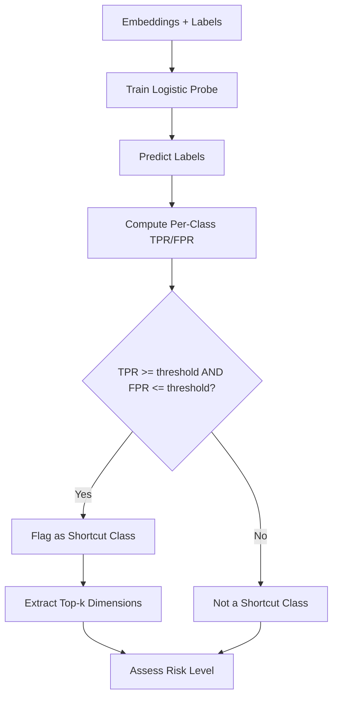

# Frequency Detector

**Embedding-space frequency shortcut detector** detects whether class signals are overly concentrated in a small set of embedding dimensions. It does not localize input-domain frequency artifacts (e.g., image Fourier bands). Instead, it identifies representational shortcut signatures from class-separable dimensions.

## How It Works

1. **Train a probe** (logistic regression by default) on embeddings vs. task labels
2. **Predict labels** using the probe (on training data or a holdout split)
3. **Compute per-class TPR/FPR** from the probe predictions
4. **Flag shortcut classes** where TPR >= threshold AND FPR <= threshold
5. **Extract top-k dimensions** from the probe coefficient magnitudes
6. **Assess risk** based on the fraction of flagged classes



## Basic Usage

```python
from shortcut_detect import FrequencyDetector

detector = FrequencyDetector(
    top_percent=0.05,
    tpr_threshold=0.5,
    fpr_threshold=0.15,
    probe_evaluation="holdout",
    probe_holdout_frac=0.2,
)

detector.fit(embeddings, labels)
report = detector.get_report()

print(f"Shortcut detected: {report['shortcut_detected']}")
print(f"Risk level: {report['risk_level']}")
print(f"Shortcut classes: {report['report']['shortcut_classes']}")
```

## Parameters

| Parameter | Type | Default | Description |
|-----------|------|---------|-------------|
| `top_percent` | float | 0.05 | Fraction of top embedding dimensions to examine |
| `tpr_threshold` | float | 0.5 | Per-class true-positive-rate threshold for shortcut flagging |
| `fpr_threshold` | float | 0.15 | Per-class false-positive-rate threshold for shortcut flagging |
| `probe_estimator` | BaseEstimator | None | Optional sklearn classifier (default: LogisticRegression) |
| `probe_evaluation` | str | "train" | Evaluation mode: "train" or "holdout" |
| `probe_holdout_frac` | float | 0.2 | Holdout fraction when `probe_evaluation="holdout"` |
| `random_state` | int | 42 | Random seed for reproducibility |

## Outputs

### Report Structure

| Field | Type | Description |
|-------|------|-------------|
| `shortcut_detected` | bool | Whether any class was flagged |
| `risk_level` | str | "low", "moderate", or "high" |
| `metrics.probe_accuracy` | float | Overall probe accuracy |
| `metrics.n_shortcut_classes` | int | Number of flagged classes |
| `metrics.n_classes` | int | Total number of classes |
| `report.shortcut_classes` | list | Class labels flagged as shortcuts |
| `report.class_rates` | dict | Per-class TPR, FPR, and support |
| `report.top_dims_by_class` | dict | Top-k important dimensions per class |
| `report.confusion_matrix` | list | Confusion matrix from probe predictions |

### Interpretation

| Risk Level | Condition |
|------------|-----------|
| **Low** | No classes flagged as shortcuts |
| **Moderate** | Less than half of classes flagged |
| **High** | Half or more of classes flagged |

## Example with Synthetic Data

```python
from shortcut_detect import FrequencyDetector
from shortcut_detect.datasets import generate_linear_shortcut

# Generate data with known shortcut
X, y = generate_linear_shortcut(
    n_samples=400,
    embedding_dim=24,
    shortcut_dims=4,
)

# Detect shortcut
detector = FrequencyDetector(
    top_percent=0.1,
    probe_evaluation="holdout",
    probe_holdout_frac=0.2,
)
detector.fit(X, y)

report = detector.get_report()
print(f"Shortcut detected: {report['shortcut_detected']}")
print(f"Risk level: {report['risk_level']}")
print(f"Shortcut classes: {report['report']['shortcut_classes']}")
print(f"Probe accuracy: {report['metrics']['probe_accuracy']:.2%}")
```

## Unified API Integration

```python
from shortcut_detect import ShortcutDetector

detector = ShortcutDetector(
    methods=["frequency"],
    seed=42,
    freq_top_percent=0.05,
    freq_tpr_threshold=0.5,
    freq_fpr_threshold=0.15,
    freq_probe_evaluation="holdout",
    freq_probe_holdout_frac=0.2,
)
detector.fit(embeddings, labels)
print(detector.summary())
```

## When to Use

**Use Frequency Detector when:**

- You have only embeddings (no model access required)
- You want to check if class signal concentrates in few dimensions
- You need a fast, lightweight shortcut check
- You want to identify which embedding dimensions carry class-separable shortcuts

**Don't use Frequency Detector when:**

- You need to detect input-domain frequency artifacts (e.g., Fourier bands in images)
- Your embeddings have very few dimensions (< 10)
- You have very few samples (< 10)

## Theory

The detector is based on the observation that shortcut-reliant models tend to encode class information in a small subset of embedding dimensions. A logistic regression probe is trained to predict class labels from embeddings, and the resulting coefficient magnitudes indicate which dimensions carry the most class-separable information.

**Per-class TPR and FPR:**

$$\text{TPR}_c = \frac{TP_c}{TP_c + FN_c}, \quad \text{FPR}_c = \frac{FP_c}{FP_c + TN_c}$$

A class $c$ is flagged as a shortcut class when $\text{TPR}_c \ge \tau_{\text{TPR}}$ and $\text{FPR}_c \le \tau_{\text{FPR}}$, indicating the probe can reliably identify and isolate this class from few dimensions.

**Top-k dimensions** are extracted from the probe's coefficient matrix:

$$\text{top-k}_c = \text{argsort}(|w_c|)[-k:]$$

where $w_c$ is the coefficient vector for class $c$ and $k = \lceil \text{top\_percent} \times d \rceil$.

## See Also

- [Probe-based Detection](probe.md) - Complementary classifier approach
- [API Reference](../api/frequency.md) - Full API documentation
- [Overview](overview.md) - Compare all methods
