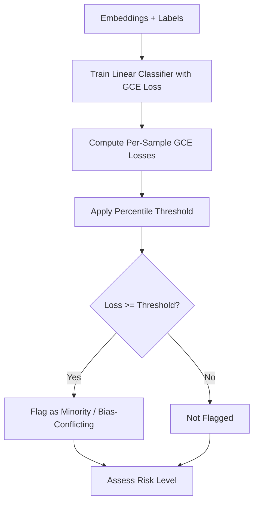

# GCE (Generalized Cross Entropy) Detector

**Generalized Cross Entropy bias detector** identifies minority or bias-conflicting samples by training a biased linear classifier with GCE loss. Samples that are hard for the biased classifier to fit (high per-sample loss) are flagged as potential shortcut-conflicting examples.

## How It Works

1. **Train a linear classifier** on embeddings with GCE loss (q ~ 0.7)
2. **Compute per-sample GCE loss** on the training set
3. **Threshold losses** at a configurable percentile (default: 90th)
4. **Flag high-loss samples** as minority/bias-conflicting
5. **Assess risk** based on the ratio of flagged samples



## Basic Usage

```python
from shortcut_detect.gce import GCEDetector

detector = GCEDetector(
    q=0.7,
    loss_percentile_threshold=90.0,
    max_iter=500,
    random_state=42,
)

detector.fit(embeddings, labels)

# Inspect the report
report = detector.report_
print(f"Risk level: {report.risk_level}")
print(f"Minority ratio: {report.minority_ratio:.2%}")
print(f"Number of flagged samples: {report.n_minority}")

# Get indices of flagged samples
minority_idx = detector.get_minority_indices()
```

## Parameters

| Parameter | Type | Default | Description |
|-----------|------|---------|-------------|
| `q` | float | 0.7 | GCE parameter in (0, 1]. Lower values downweight easy samples more aggressively |
| `loss_percentile_threshold` | float | 90.0 | Percentile (0-100) above which samples are flagged as minority |
| `max_iter` | int | 500 | Maximum L-BFGS-B iterations for the linear classifier |
| `random_state` | int | 42 | Random seed for reproducibility |

## Outputs

### Report Structure (`GCEDetectorReport`)

| Field | Type | Description |
|-------|------|-------------|
| `n_samples` | int | Total number of samples |
| `n_minority` | int | Number of flagged minority samples |
| `minority_ratio` | float | Fraction of samples flagged |
| `loss_mean` | float | Mean per-sample GCE loss |
| `loss_std` | float | Standard deviation of per-sample GCE loss |
| `loss_min` | float | Minimum per-sample GCE loss |
| `loss_max` | float | Maximum per-sample GCE loss |
| `threshold` | float | Loss threshold used for flagging |
| `q` | float | GCE parameter used |
| `risk_level` | str | "low", "moderate", or "high" |
| `notes` | str | Human-readable risk summary |

### Interpretation

| Risk Level | Condition |
|------------|-----------|
| **Low** | Few high-loss samples flagged (minority ratio <= 10% and n_minority <= 20) |
| **Moderate** | Moderate flagged samples (minority ratio > 10% or n_minority > 20) |
| **High** | Many flagged samples (minority ratio > 25% or n_minority > 100) |

## Example with Synthetic Data

```python
import numpy as np
from shortcut_detect.gce import GCEDetector

# Create embeddings where a minority group differs
rng = np.random.default_rng(42)
n = 400
embeddings = rng.standard_normal((n, 16))
labels = np.array([0] * 200 + [1] * 200)

# Inject a shortcut: most class-1 samples share a spurious feature
embeddings[200:380, 0] += 3.0   # majority of class 1
embeddings[380:400, 0] -= 1.0   # minority subgroup of class 1

detector = GCEDetector(q=0.7, loss_percentile_threshold=90.0)
detector.fit(embeddings, labels)

print(f"Risk level: {detector.report_.risk_level}")
print(f"Minority samples: {detector.report_.n_minority}")
minority_idx = detector.get_minority_indices()
print(f"Flagged indices (first 10): {minority_idx[:10]}")
```

## Unified API Integration

```python
from shortcut_detect import ShortcutDetector

detector = ShortcutDetector(
    methods=["gce"],
    seed=42,
)
detector.fit(embeddings, labels)
print(detector.summary())
```

## When to Use

**Use GCE Detector when:**

- You want to identify which samples are minority or bias-conflicting
- You need a training-free (no GPU required) approach to flag hard samples
- You want to understand the loss distribution across your dataset
- You plan to use flagged samples for reweighting or resampling

**Don't use GCE Detector when:**

- You have fewer than 2 distinct labels
- Your dataset is very small (fewer than ~50 samples)
- You need group-level fairness metrics (use Demographic Parity or Equalized Odds instead)

## Theory

The Generalized Cross Entropy loss is defined as:

$$L_i = \frac{1 - p_i^q}{q}$$

where $p_i$ is the predicted probability for the true class of sample $i$. When $q \to 0$, this recovers the standard cross-entropy loss. For $q \approx 0.7$, the loss downweights easy (high-confidence) samples and emphasizes hard ones.

A biased classifier trained with GCE loss tends to memorize majority patterns first. Samples with persistently high loss are those that conflict with the majority pattern -- these are the minority or bias-conflicting examples that may indicate shortcut reliance.

## See Also

- [Demographic Parity](demographic-parity.md) - Group-level fairness detection
- [Equalized Odds](equalized-odds.md) - Another fairness-based approach
- [API Reference](../api/gce.md) - Full API documentation
- [Overview](overview.md) - Compare all methods
