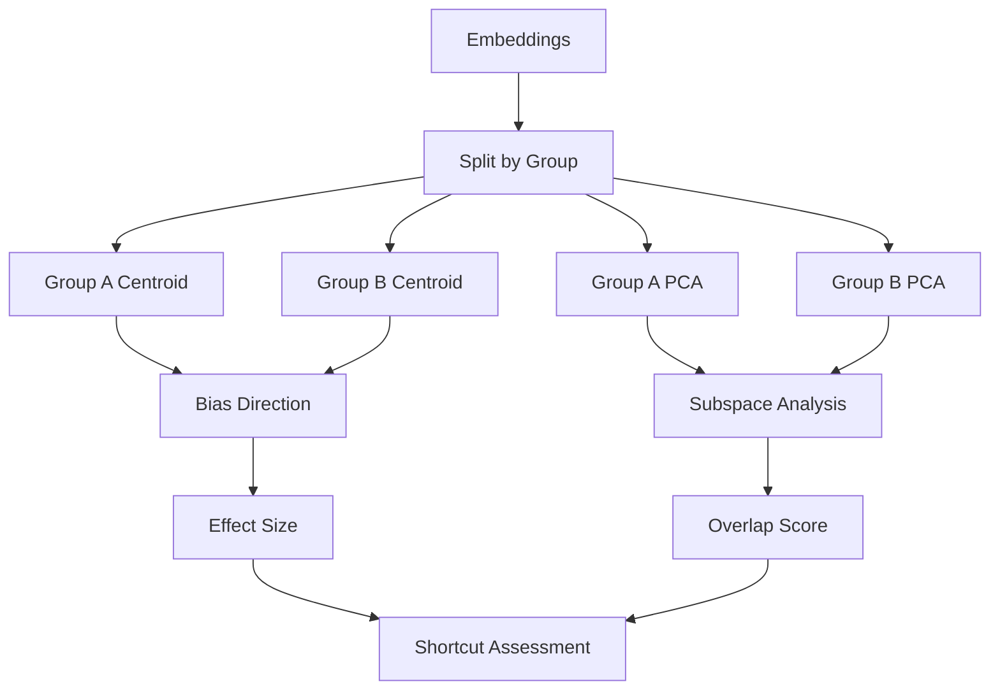

# Geometric Analysis

**Geometric analysis** detects shortcuts by analyzing the geometric structure of embeddings in high-dimensional space. It finds bias directions and examines whether group-specific subspaces overlap.

## How It Works

1. **Compute group centroids** in embedding space
2. **Find bias directions** - vectors connecting group centroids
3. **Analyze prototype subspaces** - PCA of each group's embeddings
4. **Measure subspace overlap** - do groups occupy the same regions?



## Basic Usage

```python
from shortcut_detect import GeometricShortcutAnalyzer

# Create analyzer
analyzer = GeometricShortcutAnalyzer(n_components=5)

# Fit on embeddings and group labels
analyzer.fit(embeddings, group_labels)

# Access results
print(analyzer.summary_)
print(f"Bias direction effect size: {analyzer.bias_effect_size_:.2f}")
print(f"Subspace overlap: {analyzer.subspace_overlap_:.2f}")
```

## Parameters

| Parameter | Type | Default | Description |
|-----------|------|---------|-------------|
| `n_components` | int | 5 | Number of PCA components per group |
| `normalize` | bool | True | Normalize embeddings before analysis |
| `random_state` | int | None | Random seed for reproducibility |

## Outputs

### Attributes

| Attribute | Type | Description |
|-----------|------|-------------|
| `bias_direction_` | ndarray | Unit vector from group A to group B centroid |
| `bias_effect_size_` | float | Cohen's d along bias direction |
| `subspace_overlap_` | float | Principal angle overlap (0-1) |
| `group_centroids_` | dict | Centroid per group |
| `group_pca_` | dict | PCA model per group |
| `projections_` | dict | Projections onto bias direction |
| `summary_` | str | Human-readable summary |

### Interpretation

| Metric | Low Risk | Medium Risk | High Risk |
|--------|----------|-------------|-----------|
| **Bias Effect Size** | < 0.3 | 0.3 - 0.7 | > 0.7 |
| **Subspace Overlap** | > 0.8 | 0.5 - 0.8 | < 0.5 |

!!! note "Interpretation"
    - **High effect size** = Groups are well-separated along bias direction
    - **Low subspace overlap** = Groups occupy different regions of embedding space
    - Both indicate strong shortcuts

## Bias Direction Analysis

The bias direction is the vector connecting group centroids:

```python
# Access bias direction
bias_dir = analyzer.bias_direction_

# Project embeddings onto bias direction
projections = embeddings @ bias_dir

# Visualize projection distributions
import matplotlib.pyplot as plt

fig, ax = plt.subplots(figsize=(10, 4))
for group in np.unique(group_labels):
    mask = group_labels == group
    ax.hist(projections[mask], bins=50, alpha=0.5, label=f'Group {group}')
ax.set_xlabel('Projection onto Bias Direction')
ax.set_ylabel('Frequency')
ax.legend()
plt.title(f'Bias Direction (Effect Size: {analyzer.bias_effect_size_:.2f})')
plt.tight_layout()
plt.savefig('bias_direction.png')
```

## Subspace Analysis

Analyze how much each group's principal subspace overlaps:

```python
# Get group-specific PCA
pca_group_0 = analyzer.group_pca_[0]
pca_group_1 = analyzer.group_pca_[1]

# Explained variance per group
print(f"Group 0 explained variance: {pca_group_0.explained_variance_ratio_}")
print(f"Group 1 explained variance: {pca_group_1.explained_variance_ratio_}")

# Subspace overlap (principal angles)
print(f"Subspace overlap: {analyzer.subspace_overlap_:.2f}")
```

### Principal Angles Visualization

```python
# Visualize principal components alignment
fig, axes = plt.subplots(1, 2, figsize=(12, 5))

# Group 0 components
axes[0].imshow(pca_group_0.components_[:5], aspect='auto', cmap='RdBu')
axes[0].set_title('Group 0 Principal Components')
axes[0].set_xlabel('Embedding Dimension')
axes[0].set_ylabel('Component')

# Group 1 components
axes[1].imshow(pca_group_1.components_[:5], aspect='auto', cmap='RdBu')
axes[1].set_title('Group 1 Principal Components')
axes[1].set_xlabel('Embedding Dimension')
axes[1].set_ylabel('Component')

plt.tight_layout()
plt.savefig('subspace_analysis.png')
```

## Multi-group Analysis

For more than 2 groups:

```python
# Pairwise analysis
from itertools import combinations

groups = np.unique(group_labels)
for g1, g2 in combinations(groups, 2):
    mask = (group_labels == g1) | (group_labels == g2)
    pairwise_labels = (group_labels[mask] == g2).astype(int)

    analyzer = GeometricShortcutAnalyzer()
    analyzer.fit(embeddings[mask], pairwise_labels)

    print(f"Groups {g1} vs {g2}:")
    print(f"  Effect size: {analyzer.bias_effect_size_:.2f}")
    print(f"  Subspace overlap: {analyzer.subspace_overlap_:.2f}")
```

## Debiasing with Geometric Analysis

Use the bias direction for debiasing:

```python
# Project out bias direction (linear debiasing)
def debias_embeddings(embeddings, bias_direction):
    """Remove bias direction from embeddings."""
    projections = embeddings @ bias_direction.reshape(-1, 1)
    return embeddings - projections @ bias_direction.reshape(1, -1)

# Apply debiasing
embeddings_debiased = debias_embeddings(embeddings, analyzer.bias_direction_)

# Verify debiasing worked
analyzer_after = GeometricShortcutAnalyzer()
analyzer_after.fit(embeddings_debiased, group_labels)
print(f"Effect size after debiasing: {analyzer_after.bias_effect_size_:.2f}")
```

## Example with Synthetic Data

```python
from shortcut_detect import GeometricShortcutAnalyzer, generate_linear_shortcut

# Generate data with strong linear shortcut
X, y_task, y_group = generate_linear_shortcut(
    n_samples=1000,
    n_features=100,
    shortcut_strength=0.9,
    random_state=42
)

# Analyze
analyzer = GeometricShortcutAnalyzer(n_components=5)
analyzer.fit(X, y_group)

print(analyzer.summary_)
# Expected output:
# GEOMETRIC ANALYSIS SUMMARY
# ==============================
# Bias Direction Effect Size: 1.85 (HIGH)
# Subspace Overlap: 0.32 (LOW)
#
# INTERPRETATION:
# Strong shortcuts detected. Group embeddings are well-separated
# and occupy different regions of the embedding space.
```

## When to Use Geometric Analysis

**Use geometric analysis when:**

- You want to understand the geometric structure of bias
- You plan to apply debiasing techniques
- You need interpretable bias directions
- Groups may occupy different subspaces

**Don't use geometric analysis when:**

- Biases are highly non-linear
- You have very few samples per group (< 30)
- Embeddings are very high-dimensional relative to samples

## Theory

### Bias Direction

The bias direction is defined as:

$$\mathbf{d} = \frac{\mu_1 - \mu_0}{||\mu_1 - \mu_0||}$$

Where $\mu_g$ is the centroid of group $g$.

### Effect Size

Cohen's d along the bias direction:

$$d = \frac{\bar{p}_1 - \bar{p}_0}{s_{\text{pooled}}}$$

Where $\bar{p}_g$ is the mean projection of group $g$ onto the bias direction.

### Subspace Overlap

Measured via principal angles between group subspaces:

$$\theta_i = \cos^{-1}(\sigma_i)$$

Where $\sigma_i$ are singular values of $U_0^T U_1$ (principal component matrices).

Overlap score:
$$\text{overlap} = \frac{1}{k} \sum_{i=1}^{k} \cos(\theta_i)$$

## See Also

- [HBAC Clustering](hbac.md) - Clustering-based detection
- [API Reference](../api/geometric.md) - Full API documentation
- [Overview](overview.md) - Compare all methods
