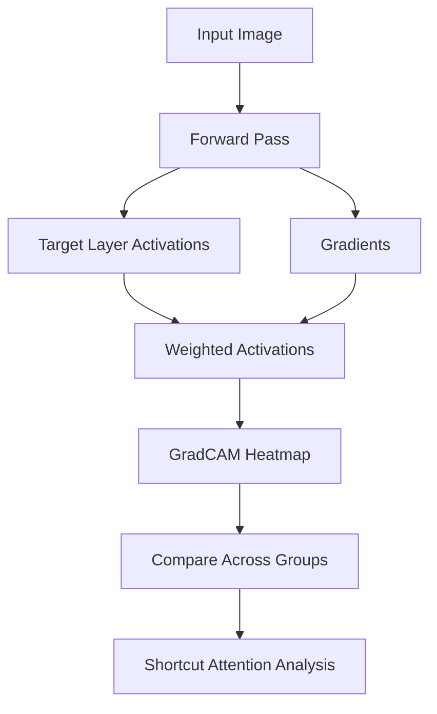

# GradCAM Analysis

**GradCAM (Gradient-weighted Class Activation Mapping)** visualizes which input regions your model focuses on when making predictions. When combined with shortcut detection, it reveals whether the model attends to spurious features correlated with protected attributes.

## How It Works

1. **Generate heatmaps** for each input showing model attention
2. **Compare attention patterns** between protected groups
3. **Measure overlap** between attention and known shortcut regions
4. **Identify** if the model focuses on different features for different groups



## Basic Usage

```python
from shortcut_detect import GradCAMHeatmapGenerator
import torch

# Load your model
model = torch.load("model.pth")
model.eval()

# Specify target layer (usually last conv layer)
target_layer = model.features[-1]  # Adjust for your architecture

# Create GradCAM generator
gradcam = GradCAMHeatmapGenerator(
    model=model,
    target_layer=target_layer,
    device='cuda'
)

# Generate heatmap for an image
heatmap = gradcam.generate(image_tensor, target_class=1)

# Visualize
gradcam.visualize(image_tensor, heatmap, save_path="attention.png")
```

## Parameters

| Parameter | Type | Default | Description |
|-----------|------|---------|-------------|
| `model` | nn.Module | required | PyTorch model |
| `target_layer` | nn.Module | required | Layer to compute GradCAM on |
| `device` | str | 'cuda' | Device for computation |
| `use_guided` | bool | False | Use Guided GradCAM |

## Outputs

### Methods

| Method | Returns | Description |
|--------|---------|-------------|
| `generate(input, class)` | ndarray | Heatmap for given input and class |
| `generate_batch(inputs, classes)` | list[ndarray] | Batch heatmap generation |
| `visualize(input, heatmap)` | None | Overlay heatmap on input |
| `compare_groups(inputs, groups)` | AttentionOverlapResult | Compare attention across groups |

### AttentionOverlapResult

```python
@dataclass
class AttentionOverlapResult:
    overlap_score: float        # Attention overlap between groups
    group_heatmaps: dict        # Average heatmap per group
    divergence_regions: ndarray # Regions with divergent attention
    summary: str                # Human-readable summary
```

## Attention Comparison

Compare model attention between protected groups:

```python
from shortcut_detect import GradCAMHeatmapGenerator

# Generate heatmaps for all samples
heatmaps = []
for image in images:
    heatmap = gradcam.generate(image, target_class=predictions[i])
    heatmaps.append(heatmap)
heatmaps = np.stack(heatmaps)

# Compare attention between groups
result = gradcam.compare_groups(heatmaps, group_labels)

print(f"Attention overlap: {result.overlap_score:.2f}")
print(result.summary)

# Visualize divergent regions
import matplotlib.pyplot as plt

fig, axes = plt.subplots(1, 3, figsize=(15, 5))

axes[0].imshow(result.group_heatmaps[0], cmap='jet')
axes[0].set_title('Group 0 Average Attention')

axes[1].imshow(result.group_heatmaps[1], cmap='jet')
axes[1].set_title('Group 1 Average Attention')

axes[2].imshow(result.divergence_regions, cmap='RdBu')
axes[2].set_title('Attention Divergence')

plt.tight_layout()
plt.savefig('attention_comparison.png')
```

## Shortcut Detection with GradCAM

Detect if the model attends to shortcut features:

```python
# Define shortcut region (e.g., hospital watermark location)
shortcut_mask = np.zeros((224, 224))
shortcut_mask[10:50, 10:100] = 1  # Top-left corner

# Measure attention overlap with shortcut region
def shortcut_attention(heatmap, shortcut_mask):
    """Fraction of attention on shortcut region."""
    heatmap_norm = heatmap / heatmap.sum()
    return (heatmap_norm * shortcut_mask).sum()

# Check each sample
shortcut_attention_scores = []
for heatmap in heatmaps:
    score = shortcut_attention(heatmap, shortcut_mask)
    shortcut_attention_scores.append(score)

print(f"Mean attention on shortcut: {np.mean(shortcut_attention_scores):.2%}")
print(f"Samples with >10% shortcut attention: {(np.array(shortcut_attention_scores) > 0.1).mean():.2%}")
```

## Layer Selection

Choose the right layer for GradCAM:

```python
# For ResNet
target_layer = model.layer4[-1]  # Last residual block

# For VGG
target_layer = model.features[-1]  # Last conv layer

# For Vision Transformers (ViT)
target_layer = model.blocks[-1].norm1  # Last attention block

# For custom models, find conv layers
def find_conv_layers(model):
    conv_layers = []
    for name, module in model.named_modules():
        if isinstance(module, torch.nn.Conv2d):
            conv_layers.append((name, module))
    return conv_layers

layers = find_conv_layers(model)
print("Available conv layers:", [name for name, _ in layers])
```

## Visualization Options

### Basic Overlay

```python
gradcam.visualize(
    image_tensor,
    heatmap,
    alpha=0.4,  # Transparency
    colormap='jet',
    save_path="basic_overlay.png"
)
```

### Side-by-Side Comparison

```python
fig, axes = plt.subplots(1, 3, figsize=(15, 5))

# Original image
axes[0].imshow(image_tensor.permute(1, 2, 0).cpu())
axes[0].set_title('Original')
axes[0].axis('off')

# Heatmap
axes[1].imshow(heatmap, cmap='jet')
axes[1].set_title('GradCAM Heatmap')
axes[1].axis('off')

# Overlay
overlay = gradcam.overlay(image_tensor, heatmap)
axes[2].imshow(overlay)
axes[2].set_title('Overlay')
axes[2].axis('off')

plt.tight_layout()
plt.savefig('gradcam_comparison.png')
```

### Guided GradCAM

For sharper visualizations:

```python
gradcam = GradCAMHeatmapGenerator(
    model=model,
    target_layer=target_layer,
    use_guided=True  # Enable Guided GradCAM
)

# Generates sharper, more localized heatmaps
heatmap_guided = gradcam.generate(image_tensor, target_class=1)
```

## Batch Processing

Efficient processing of many images:

```python
from torch.utils.data import DataLoader

# Create dataloader
dataloader = DataLoader(dataset, batch_size=32, shuffle=False)

# Process batches
all_heatmaps = []
for batch in dataloader:
    images, labels, groups = batch
    images = images.to('cuda')

    heatmaps = gradcam.generate_batch(images, labels)
    all_heatmaps.extend(heatmaps)

# Analyze by group
all_heatmaps = np.stack(all_heatmaps)
result = gradcam.compare_groups(all_heatmaps, all_groups)
```

## When to Use GradCAM

**Use GradCAM when:**

- You have access to the model architecture
- You want visual explanations of shortcuts
- You're working with image data
- You need to identify specific image regions causing bias

**Don't use GradCAM when:**

- You only have embeddings (no model access)
- Working with non-image data
- GPU is unavailable (very slow on CPU)
- Model uses attention mechanisms (consider attention visualization instead)

## Integration with ShortcutDetector

GradCAM works alongside other detection methods:

```python
from shortcut_detect import ShortcutDetector, GradCAMHeatmapGenerator

# First, detect shortcuts with embedding-based methods
detector = ShortcutDetector(methods=['hbac', 'probe', 'statistical'])
detector.fit(embeddings, group_labels)

# Check if probe accuracy indicates shortcuts
results = detector.get_results()
if results['probe']['accuracy'] > 0.7:
    print("Shortcuts detected! Using GradCAM for visual analysis...")

    # Then use GradCAM to visualize where shortcuts manifest
    gradcam = GradCAMHeatmapGenerator(model, target_layer)
    result = gradcam.compare_groups(images, group_labels)

    print(f"Attention overlap: {result.overlap_score:.2f}")
    print("Saving divergence visualization...")
    plt.imsave('divergence.png', result.divergence_regions, cmap='RdBu')
```

## Theory

GradCAM computes importance weights by global-average-pooling gradients:

$$\alpha_k^c = \frac{1}{Z} \sum_i \sum_j \frac{\partial y^c}{\partial A_{ij}^k}$$

The heatmap is a weighted combination of feature maps:

$$L_{\text{GradCAM}}^c = \text{ReLU}\left(\sum_k \alpha_k^c A^k\right)$$

Where:

- $y^c$ is the score for class $c$
- $A^k$ is the $k$-th feature map
- $Z$ is the spatial size of feature maps

## See Also

- [Geometric Analysis](geometric.md) - Subspace-based shortcuts
- [API Reference](../api/gradcam.md) - Full API documentation
- [Overview](overview.md) - Compare all methods
