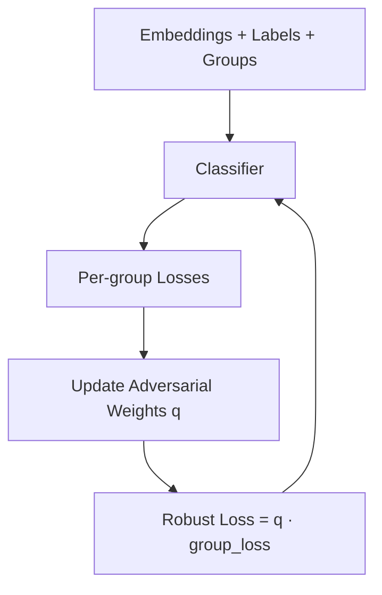

# GroupDRO (Worst-Group Robustness)

**Group Distributionally Robust Optimization (GroupDRO)** detects shortcuts by measuring **performance disparities across predefined groups**.
If a model performs significantly worse on one group than others, it is strong evidence that the embeddings encode **group-dependent shortcuts or biases**.

Unlike clustering-based methods, GroupDRO is **supervised** and **optimization-based**: it trains a classifier on embeddings while adversarially emphasizing the worst-performing group.

---

## How It Works

GroupDRO trains a lightweight classifier on embeddings using a **robust objective** that minimizes the *worst-group loss* instead of the average loss.

At each training step:

1. **Compute per-group losses** for the current batch
2. **Update adversarial group weights** to emphasize high-loss groups
3. **Optimize the classifier** using the weighted (robust) loss
4. **Track worst-group vs average performance**



If one group consistently receives high adversarial weight and low accuracy, this indicates **shortcut reliance or group-specific failure modes**.

---

## Basic Usage

### Via the Unified API (Recommended)

```python
from shortcut_detect import ShortcutDetector
import numpy as np

# Precomputed embeddings
embeddings = np.load("embeddings.npy")
labels = np.load("labels.npy")
group_labels = np.load("groups.npy")  # required

detector = ShortcutDetector(methods=["groupdro"])
detector.fit(embeddings, labels, group_labels=group_labels)

print(detector.summary())
detector.generate_report("groupdro_report.html")
```

### Standalone Usage

```python
from shortcut_detect.groupdro import GroupDRODetector, GroupDROConfig

config = GroupDROConfig(
    n_epochs=10,
    alpha=0.2,
    robust_step_size=0.01,
)

detector = GroupDRODetector(config)
detector.fit(embeddings, labels, group_labels)

report = detector.get_report()["report"]
print(report["final"]["worst_group_acc"])
```

### Advanced: Loader Hooks for GroupDRO

You can customize DataLoader creation while keeping GroupDRO training logic unchanged.

```python
import torch
from torch.utils.data import DataLoader

def groupdro_loader_factory(req):
    # req.stage in {"train", "val", "full"} depending on path
    return DataLoader(
        req.dataset,
        batch_size=req.batch_size,
        shuffle=req.shuffle,
        num_workers=req.num_workers,
        pin_memory=req.pin_memory,
        drop_last=req.drop_last,
        **req.extra_kwargs,
    )

config = GroupDROConfig(
    n_epochs=5,
    loader_factory=groupdro_loader_factory,
    stage_loader_overrides={"train": {"batch_size": 256}},
)
```

### Advanced: File-Backed Datasets (Large Data)

`GroupDRODetector` now supports loader-native training via `fit_dataset(...)` and `fit_loaders(...)`.

```python
import torch
from shortcut_detect.groupdro.groupdro import GroupDROConfig, GroupDRODetector

class GroupDataset(torch.utils.data.Dataset):
    def __init__(self, rows):
        self.rows = rows

    def __len__(self):
        return len(self.rows)

    def __getitem__(self, idx):
        x = load_embedding_from_file(self.rows[idx])  # shape (d,)
        y = load_label(self.rows[idx])                # class id
        g = load_group(self.rows[idx])                # protected group id
        return {"embeddings": x, "labels": y, "group_labels": g}

cfg = GroupDROConfig(n_epochs=5, batch_size=128, device="cpu")
detector = GroupDRODetector(cfg)
detector.fit_dataset(GroupDataset(index_rows))
```

For `IterableDataset` inputs, pass a validation dataset and `data_spec`:

```python
detector.fit_dataset(
    train_iterable,
    val_dataset=val_iterable,
    data_spec={"n_features": 512, "n_classes": 2, "n_groups": 3},
)
```

---

## Parameters

### Core Training Parameters

| Parameter      | Type  | Default | Description               |
| -------------- | ----- | ------- | ------------------------- |
| `n_epochs`     | int   | 10      | Number of training epochs |
| `batch_size`   | int   | 128     | Batch size                |
| `lr`           | float | 1e-3    | Learning rate             |
| `weight_decay` | float | 5e-5    | L2 regularization         |
| `momentum`     | float | 0.9     | SGD momentum              |

### Robust Optimization Parameters

| Parameter                    | Type         | Default | Description                              |
| ---------------------------- | ------------ | ------- | ---------------------------------------- |
| `robust`                     | bool         | True    | Enable GroupDRO objective                |
| `alpha`                      | float        | 0.2     | Mass of groups to focus on (used in BTL) |
| `robust_step_size`           | float        | 0.01    | Adversarial weight update step size      |
| `gamma`                      | float        | 0.1     | EMA decay for historical group loss      |
| `use_normalized_loss`        | bool         | False   | Normalize group losses before update     |
| `btl`                        | bool         | False   | Use greedy (BTL-style) robust objective  |
| `minimum_variational_weight` | float        | 0.0     | Weight smoothing for BTL                 |
| `generalization_adjustment`  | list or None | None    | Per-group adjustment term                |
| `automatic_adjustment`       | bool         | False   | Update adjustment using train–val gap    |

### Model Parameters

| Parameter    | Type        | Default | Description                |
| ------------ | ----------- | ------- | -------------------------- |
| `hidden_dim` | int or None | None    | Optional hidden layer size |
| `dropout`    | float       | 0.0     | Dropout rate               |

---

## Outputs

### Report Structure

`results_["groupdro"]["report"]` contains:

| Key               | Type    | Description                                |
| ----------------- | ------- | ------------------------------------------ |
| `history`         | list    | Per-epoch training/validation metrics      |
| `final`           | dict    | Final group-wise statistics                |
| `final_adv_probs` | ndarray | Final adversarial group weights            |
| `group_id_map`    | dict    | Mapping from original group IDs to indices |

### Key Metrics

| Metric             | Description                            |
| ------------------ | -------------------------------------- |
| `avg_acc`          | Overall accuracy                       |
| `worst_group_acc`  | Accuracy of the worst-performing group |
| `avg_acc_group:i`  | Accuracy for group *i*                 |
| `avg_loss_group:i` | Average loss for group *i*             |

---

## Interpretation

### Risk Assessment

| Pattern                                      | Interpretation                    |
| -------------------------------------------- | --------------------------------- |
| High avg acc, **low worst-group acc**        | Strong shortcut or bias           |
| Large gap (avg − worst) > 10%                | High risk                         |
| Worst-group acc improves slowly              | Model relies on dominant groups   |
| Adversarial weight concentrates on one group | That group is systematically hard |

**Rule of thumb**

> If GroupDRO consistently upweights one group and that group has low accuracy, the embeddings encode a shortcut correlated with group membership.

---

## Visualization

GroupDRO integrates with the reporting system to produce:

### Worst-Group Accuracy Curve

Shows whether the model improves on the hardest group over training.

```python
# Included automatically in HTML report
```

### Adversarial Weight Distribution

Bar plot of final adversarial group weights `q`:

* High `q` → group dominates robust objective
* Flat `q` → balanced performance

---

## Example with Synthetic Data

```python
from shortcut_detect import ShortcutDetector
import numpy as np

# Synthetic dataset with a hard group
X, y, g = generate_linear_shortcut(
    n_samples=800,
    embedding_dim=20,
    shortcut_dims=1
)

# Make one group harder
g[:400] = 0
g[400:] = 1

detector = ShortcutDetector(
    methods=["groupdro"],
    groupdro_n_epochs=5,
    groupdro_robust_step_size=0.05,
)

detector.fit(X, y, group_labels=g)
print(detector.results_["groupdro"]["report"]["final"]["worst_group_acc"])
```

Expected behavior:

* Worst-group accuracy significantly lower than average
* Adversarial weights concentrate on the harder group

---

## When to Use GroupDRO

**Use GroupDRO when:**

* You have **explicit group labels** (e.g. demographics, environments)
* You want **quantitative evidence of group disparities**
* You suspect shortcuts tied to protected attributes
* You want training-time signals, not just geometry

**Don’t use GroupDRO when:**

* Group labels are unavailable
* You want fully unsupervised detection (use HBAC)
* Dataset is extremely small (< 100 samples)
* Groups are perfectly balanced and indistinguishable

---

## Theory

GroupDRO solves:

$$
\min_\theta \max_{q \in \Delta} \sum_{g=1}^G q_g , \mathcal{L}_g(\theta)
$$

Where:

* $\mathcal{L}_g$ is the loss on group $g$
* $q$ is an adversarial distribution over groups
* $\Delta$ is the probability simplex

The adversarial update is:

$$
q_g \leftarrow \frac{q_g \exp(\eta \cdot \ell_g)}{\sum_{h} q_h \exp(\eta \cdot \ell_h)}
$$

This forces the model to focus on its **worst-performing groups**, making GroupDRO an effective *bias detector* when performance gaps persist.

---

## See Also

* [HBAC Clustering](hbac.md) – Unsupervised shortcut discovery
* [Probe-based Detection](probe.md) – Predictability of group attributes
* [Statistical Tests](statistical.md) – Feature-wise group differences
* [Overview](overview.md) – Comparing all detection methods
* [API Reference](../api/groupdro.md) – Full GroupDRO API
