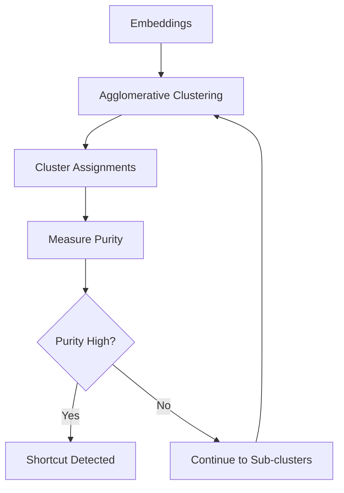

# HBAC Clustering

**Hierarchical Bias-Aware Clustering** detects if your embeddings naturally cluster by protected attributes rather than by task-relevant features.

## How It Works

HBAC performs hierarchical clustering on embeddings and measures how well the resulting clusters align with protected group labels:

1. **Cluster embeddings** using agglomerative clustering
2. **Measure purity** - how homogeneous clusters are with respect to protected attributes
3. **Assess linearity** - how well cluster boundaries separate groups
4. **Iterate** - recursively analyze sub-clusters



## Basic Usage

```python
from shortcut_detect import HBACDetector

# Create detector
detector = HBACDetector(
    max_iterations=3,      # Maximum depth of recursion
    min_cluster_size=0.05  # Minimum cluster size as fraction
)

# Fit on embeddings and group labels
detector.fit(embeddings, group_labels)

# Access results
print(f"Purity: {detector.purity_:.2f}")
print(f"Linearity: {detector.linearity_:.2f}")
print(f"Shortcut detected: {detector.shortcut_detected_}")
```

## Parameters

| Parameter | Type | Default | Description |
|-----------|------|---------|-------------|
| `max_iterations` | int | 3 | Maximum recursion depth |
| `min_cluster_size` | float | 0.05 | Minimum cluster size (fraction) |
| `linkage` | str | 'ward' | Clustering linkage method |
| `distance_metric` | str | 'euclidean' | Distance metric for clustering |

## Outputs

### Attributes

| Attribute | Type | Description |
|-----------|------|-------------|
| `purity_` | float | Cluster purity (0-1) |
| `linearity_` | float | Linear separability score (0-1) |
| `shortcut_detected_` | bool | Whether shortcut was detected |
| `cluster_labels_` | ndarray | Cluster assignments |
| `dendrogram_` | dict | Dendrogram data for visualization |

### Interpretation

| Metric | Low Risk | Medium Risk | High Risk |
|--------|----------|-------------|-----------|
| **Purity** | < 0.6 | 0.6 - 0.8 | > 0.8 |
| **Linearity** | < 0.5 | 0.5 - 0.7 | > 0.7 |

**High purity + high linearity** = Strong shortcut evidence

## Visualization

```python
import matplotlib.pyplot as plt
from scipy.cluster.hierarchy import dendrogram

# Get dendrogram data
fig, ax = plt.subplots(figsize=(10, 6))
dendrogram(
    detector.dendrogram_,
    ax=ax,
    leaf_rotation=90,
    leaf_font_size=8
)
plt.title("HBAC Dendrogram")
plt.xlabel("Sample Index")
plt.ylabel("Distance")
plt.tight_layout()
plt.savefig("hbac_dendrogram.png")
```

## Example with Synthetic Data

```python
from shortcut_detect import HBACDetector, generate_linear_shortcut

# Generate data with strong shortcut
X, y_task, y_group = generate_linear_shortcut(
    n_samples=500,
    n_features=100,
    shortcut_strength=0.9,
    random_state=42
)

# Detect shortcut
detector = HBACDetector()
detector.fit(X, y_group)

print(f"Purity: {detector.purity_:.2f}")      # Expected: ~0.90
print(f"Linearity: {detector.linearity_:.2f}")  # Expected: ~0.85
print(f"Detected: {detector.shortcut_detected_}")  # Expected: True
```

## When to Use HBAC

**Use HBAC when:**

- You want interpretable hierarchical structure
- Your embeddings may have natural cluster boundaries
- You need fast analysis (no training required)
- You want to visualize bias structure

**Don't use HBAC when:**

- Groups are uniformly mixed (no clusters)
- You have very few samples (< 50)
- Groups have highly overlapping distributions

## Advanced Configuration

### Custom Linkage

```python
# Different linkage methods
detector = HBACDetector(linkage='complete')  # Maximum linkage
detector = HBACDetector(linkage='average')   # Average linkage
detector = HBACDetector(linkage='ward')      # Ward's method (default)
```

### Custom Distance Metric

```python
# Cosine distance for text embeddings
detector = HBACDetector(distance_metric='cosine')
```

### Fine-grained Iteration Control

```python
detector = HBACDetector(
    max_iterations=5,       # Deeper analysis
    min_cluster_size=0.02,  # Allow smaller clusters
)
```

## Theory

HBAC is based on the observation that if a model has learned shortcuts, embeddings from the same protected group will be more similar to each other than to embeddings from other groups.

**Purity** measures this clustering:

$$\text{Purity} = \frac{1}{N} \sum_{k=1}^{K} \max_j |c_k \cap g_j|$$

Where $c_k$ is cluster $k$ and $g_j$ is group $j$.

**Linearity** measures how well a linear classifier can separate the clusters:

$$\text{Linearity} = \text{Accuracy}(\text{LinearSVM}(X, \text{clusters}))$$

## See Also

- [Probe-based Detection](probe.md) - Complementary classifier approach
- [API Reference](../api/hbac.md) - Full API documentation
- [Overview](overview.md) - Compare all methods
