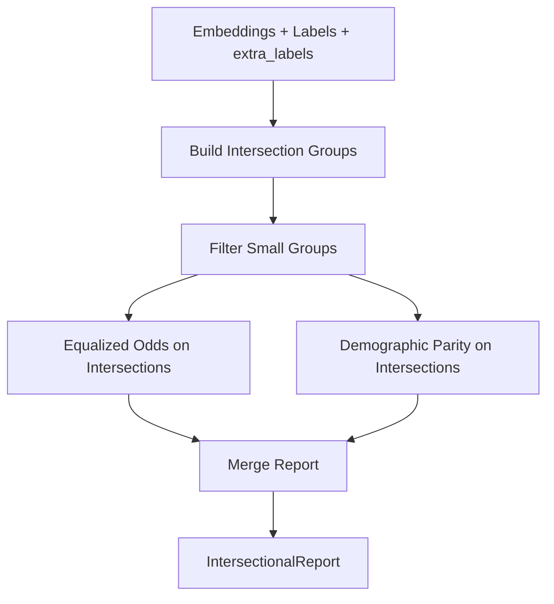

# Intersectional Fairness Analysis

**Intersectional** detects shortcuts by evaluating fairness metrics across **intersections of demographic attributes** (e.g., Black + Female, White + Male).

Based on [Buolamwini & Gebru (2018, Gender Shades)](https://dl.acm.org/doi/10.1145/3278721.3278720), single-attribute fairness analysis can miss compounded disparities at intersections. For example, Black women may have worse model accuracy than all other groups, even when race-only or gender-only analysis shows smaller gaps.

---

## How It Works

The Intersectional detector:

1. **Combines demographic attributes** from `extra_labels` (e.g., race and gender) into intersection groups (e.g., "Black_Female", "White_Male")
2. **Filters** samples with missing values and groups below `min_group_size`
3. **Runs Equalized Odds and Demographic Parity** on the intersection groups
4. **Produces** TPR/FPR/positive-rate metrics per intersection and aggregated gaps



**Key insight**: Disparities can compound at intersections. A model may appear fair on race alone or gender alone, yet show large gaps for specific intersections like Black women.

---

## Basic Usage

### Via the Unified API (Recommended)

```python
from shortcut_detect import ShortcutDetector
import numpy as np

# Precomputed embeddings
embeddings = np.load("embeddings.npy")
labels = np.load("labels.npy")  # Binary labels required

# At least 2 demographic attributes required
extra_labels = {
    "race": np.array(["Black", "White", "Asian", ...]),
    "gender": np.array(["Male", "Female", "Male", ...]),
}

detector = ShortcutDetector(methods=["intersectional"])
detector.fit(embeddings, labels, extra_labels=extra_labels)

print(detector.summary())
```

### Standalone Usage

```python
from shortcut_detect.fairness import IntersectionalDetector

detector = IntersectionalDetector(
    min_group_size=10,
    tpr_gap_threshold=0.1,
    fpr_gap_threshold=0.1,
    dp_gap_threshold=0.1,
)

detector.fit(embeddings, labels, extra_labels)

print(f"TPR Gap: {detector.tpr_gap_:.3f}")
print(f"FPR Gap: {detector.fpr_gap_:.3f}")
print(f"DP Gap: {detector.dp_gap_:.3f}")
print(f"Risk Level: {detector.report_.risk_level}")
```

---

## Parameters

| Parameter | Type | Default | Description |
|-----------|------|---------|-------------|
| `estimator` | Estimator | LogisticRegression | Classifier to train on embeddings |
| `min_group_size` | int | 10 | Minimum samples per intersection group |
| `tpr_gap_threshold` | float | 0.1 | Threshold for flagging TPR disparity |
| `fpr_gap_threshold` | float | 0.1 | Threshold for flagging FPR disparity |
| `dp_gap_threshold` | float | 0.1 | Threshold for flagging demographic parity disparity |
| `intersection_attributes` | list[str] | None | Which keys in extra_labels to use; if None, uses first 2 non-reserved |
| `separator` | str | "_" | Separator for joining attribute values (e.g., "Black_Female") |

---

## Outputs

### Report Structure

`results_["intersectional"]["report"]` contains an `IntersectionalReport`:

| Field | Type | Description |
|-------|------|-------------|
| `intersection_metrics` | dict | Per-intersection TPR, FPR, positive_rate, support |
| `attribute_names` | list | Names of attributes used (e.g., ["race", "gender"]) |
| `tpr_gap` | float | Max TPR - Min TPR across intersections |
| `fpr_gap` | float | Max FPR - Min FPR across intersections |
| `dp_gap` | float | Max positive rate - Min positive rate across intersections |
| `overall_accuracy` | float | Classifier accuracy on analyzed samples |
| `overall_positive_rate` | float | Overall positive prediction rate |
| `risk_level` | str | "low", "moderate", or "high" |
| `notes` | str | Human-readable interpretation |
| `reference` | str | "Buolamwini & Gebru 2018" |

---

## Data Requirements

- **extra_labels**: Dictionary with at least 2 demographic attribute arrays (e.g., `{"race": ..., "gender": ...}`). Values can be strings or categorical codes.
- **Reserved keys** `spurious` and `early_epoch_reps` are excluded from intersection attributes.
- **Binary labels** required for the task (same as Equalized Odds).

### Custom CSV Format

For the dashboard or custom CSV upload:

- **Embeddings mode**: Include `attr_race` and `attr_gender` columns (or `group_label` + `attr_gender`) for intersectional analysis.
- **Sample data**: CheXpert demo uses `PRIMARY_RACE` and `GENDER` from the demographics file.

---

## When to Use

- You want **intersectional fairness** beyond single-attribute analysis
- You have **multiple demographic attributes** (e.g., race, gender)
- You want to detect **compounded disparities** at intersections (e.g., Buolamwini & Gebru 2018)
- You need regulatory or fairness reporting across subgroups

---

## Reference

Buolamwini, J., & Gebru, T. (2018). Gender shades: Intersectional accuracy disparities in commercial gender classification. *Conference on fairness, accountability and transparency* (pp. 77–91). PMLR.
