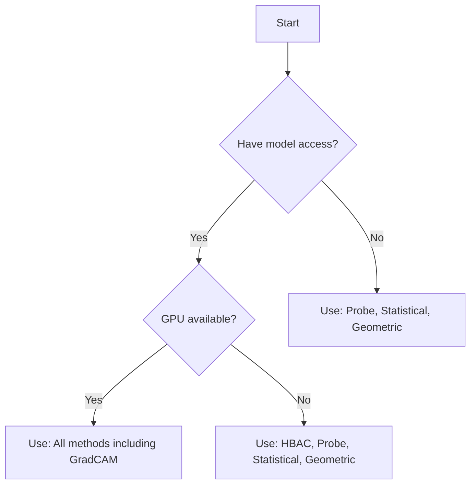

# Detection Methods Overview

ShortKit-ML provides multiple complementary methods for detecting shortcuts in embedding spaces. Each method has different strengths and is sensitive to different types of biases.

## Why Multiple Methods?

No single method can detect all types of shortcuts. Using multiple methods provides:

- **Comprehensive coverage** - Different methods catch different bias patterns
- **Validation** - Agreement across methods increases confidence
- **Insights** - Each method reveals different aspects of the bias

## Methods Comparison

| Method | What It Detects | Strengths | Limitations |
|--------|----------------|-----------|-------------|
| **HBAC** | Clustering by protected attributes | Fast, interpretable dendrograms | Assumes hierarchical structure |
| **Probe** | Information leakage | Direct measurement of predictability | Requires train/test split |
| **Statistical** | Dimension-wise differences | Identifies specific features | May miss non-linear patterns |
| **Geometric** | Bias directions in subspace | Works without labels | Requires sufficient samples per group |
| **Equalized Odds** | TPR/FPR disparities across groups | Interpretable fairness metric | Requires binary labels |
| **Demographic Parity** | Positive rate gaps across groups | Interpretable fairness metric | Requires binary labels |
| **Intersectional** | Fairness across demographic intersections | Catches compounded disparities (Buolamwini & Gebru 2018) | Requires 2+ attributes in extra_labels |
| **GroupDRO** | Worst-group performance gaps | Finds hard groups | Requires group + task labels |
| **Early-Epoch Clustering** | Early-epoch shortcut clusters | No group labels required | Needs early representations |
| **SIS** | Minimal sufficient input subsets | Model-agnostic, concise rationales | O(samples × dims) predictor calls |
| **GradCAM** | Attention on shortcut features | Visual interpretability | Requires model access, GPU |
| **SpRAy** | Heatmap clustering (Clever Hans) | Detects systematic attention artifacts | Requires heatmaps, clustering stability |
| **CAV** | Concept-level shortcut sensitivity (TCAV) | Interpretable concept tests | Requires concept/random activation sets |
| **Causal Effect** | Spurious attributes via causal effect estimation | Identifies attributes with near-zero causal effect | Requires attributes; optional interventional data |
| **VAE** | Disentangled latent shortcut dimensions | Discovers latent factors; human-interpretable traversals | Requires raw images; VAE training cost |
| **Frequency** | Concentrated class-separable dimensions | Embedding-only, no model access needed | Assumes linear probe sufficiency |
| **Generative CVAE** | Spurious attribute influence via counterfactuals | Generates embedding-space counterfactuals; measures causal effect | Requires binary group labels; seed-sensitive |
| **Shortcut Masking (M01)** | Mitigation: mask/inpaint shortcut regions | Data augmentation for retraining (Teso & Kersting 2019) | Requires shortcut regions/dims from detection |
| **Background Randomization (M02)** | Mitigation: swap foregrounds with random backgrounds | Reduces background shortcuts (Kwon et al. 2023) | Requires foreground masks; needs at least 2 images |
| **Adversarial Debiasing (M04)** | Mitigation: remove demographic encoding | Adversarial training (Zhang et al. 2018) | Requires protected labels; PyTorch |
| **Explanation Regularization (M05)** | Mitigation: penalize gradients on shortcut regions | RRR (Ross et al. 2017) | Requires model, images, labels, shortcut masks; PyTorch |
| **Last Layer Retraining (M06)** | Mitigation: retrain last layer on balanced subset | DFR (Kirichenko et al. 2023) | Requires task + group labels; sklearn |
| **Contrastive Debiasing (M07)** | Mitigation: contrastive learning to separate shortcuts | Correct-n-Contrast (Zhang et al. 2022) | Requires task + group labels; PyTorch |

## Decision Matrix

Choose methods based on your use case:



## Quick Recommendations

### For Production Audits

Use all methods for comprehensive coverage:

```python
detector = ShortcutDetector(
    methods=['hbac', 'probe', 'statistical', 'geometric', 'equalized_odds', 'demographic_parity', 'intersectional', 'groupdro']
)
```

### For Quick Screening

Use fast methods for initial assessment:

```python
detector = ShortcutDetector(
    methods=['statistical', 'probe']
)
```

### For Deep Analysis

Use all methods plus GradCAM for visual insights:

```python
detector = ShortcutDetector(
    methods=['hbac', 'probe', 'statistical', 'geometric']
)
# Plus GradCAM separately for visual analysis
gradcam = GradCAMHeatmapGenerator(model, target_layer)
```

## Interpretation Framework

### Risk Assessment

Each method produces risk indicators:

| Risk Level | HBAC Purity | Probe Accuracy | Statistical % | Geometric Effect | Equalized Odds Gap | GroupDRO Gap |
|------------|-------------|----------------|---------------|------------------|-------------------|--------------|
| **Low** | < 60% | < 60% | < 10% | < 0.3 | < 10% | < 5% |
| **Medium** | 60-80% | 60-80% | 10-30% | 0.3-0.7 | 10-20% | 5-10% |
| **High** | > 80% | > 80% | > 30% | > 0.7 | > 20% | > 10% |

### Aggregated Risk

The unified `ShortcutDetector` provides an aggregated assessment via the `summary()` method.
The aggregation strategy is controlled by the `condition_name` parameter:

| Condition | Strategy | Best For |
|-----------|----------|----------|
| `indicator_count` (default) | Counts total risk indicators. 2+ = HIGH, 1 = MODERATE, 0 = LOW | Simple audits, general use |
| `majority_vote` | Counts methods with indicators as votes | Conservative consensus-based screening |
| `weighted_risk` | Weights each detector by evidence strength (probe accuracy, stat significance, HBAC confidence, geometric effect size) | Paper results, nuanced analysis |
| `multi_attribute` | Cross-references risk across sensitive attributes; escalates when multiple attributes flag risk | Multi-demographic analysis (race + sex + age) |
| `meta_classifier` | Trained sklearn meta-classifier on detector features, or heuristic fallback | Advanced pipelines with synthetic training data |

```python
# Default aggregation
detector = ShortcutDetector(methods=['hbac', 'probe', 'statistical'])
detector.fit(embeddings, labels)
print(detector.summary())

# Weighted risk for nuanced scoring
detector = ShortcutDetector(
    methods=['hbac', 'probe', 'statistical', 'geometric'],
    condition_name='weighted_risk',
)
detector.fit(embeddings, labels)
print(detector.summary())

# Access individual method results
results = detector.get_results()
print(results['probe']['accuracy'])  # Probe accuracy
print(results['hbac']['shortcut_detected'])  # HBAC detection result
```

## Detailed Method Guides

Learn more about each method:

- [HBAC Clustering](hbac.md) - Hierarchical clustering analysis
- [Probe-based Detection](probe.md) - Classifier-based information leakage
- [Statistical Testing](statistical.md) - Feature-wise hypothesis tests
- [Geometric Analysis](geometric.md) - Subspace and direction analysis
- [Equalized Odds](equalized-odds.md) - TPR/FPR fairness analysis
- [Intersectional Analysis](intersectional-analysis.md) - Fairness across demographic intersections
- [SIS (Sufficient Input Subsets)](sis.md) - Minimal embedding dimensions for prediction (Carter et al. 2019)
- [Early-Epoch Clustering](early-epoch-clustering.md) - Early training shortcut clustering
- [GroupDRO](groupdro.md) - Worst-group robustness analysis
- [GradCAM](gradcam.md) - Visual attention analysis
- [SpRAy](spray.md) - Heatmap clustering for Clever Hans detection
- [CAV](cav.md) - Concept activation vector testing
- [Causal Effect](causal-effect.md) - Causal effect regularization for spurious attribute detection
- [VAE](vae.md) - VAE-based shortcut detection via latent disentanglement
- [Frequency](frequency.md) - Embedding-space frequency shortcut detection
- [Generative CVAE](generative-cvae.md) - Conditional VAE counterfactual shortcut detection
- [Shortcut Masking (M01)](shortcut-masking.md) - Data mitigation: mask/inpaint shortcut regions
- [Background Randomization (M02)](background-randomization.md) - Data mitigation: swap foregrounds with random backgrounds
- [Adversarial Debiasing (M04)](adversarial-debiasing.md) - Model mitigation: adversarial training to remove demographic encoding
- [Explanation Regularization (M05)](explanation-regularization.md) - Model mitigation: penalize input gradients on shortcut regions
- [Last Layer Retraining (M06)](last-layer-retraining.md) - Model mitigation: retrain last layer on group-balanced subset
- [Contrastive Debiasing (M07)](contrastive-debiasing.md) - Model mitigation: contrastive learning to separate shortcuts

## Method Limitations

All methods have limitations you should be aware of:

1. **Sample Size** - Most methods need sufficient samples per group (n > 30)
2. **Linearity** - Some methods assume linear relationships
3. **Independence** - Assumes embeddings are i.i.d. samples
4. **Single Protected Attribute** - Most fairness methods assume one protected attribute; use [Intersectional Analysis](intersectional-analysis.md) for multiple attributes.
