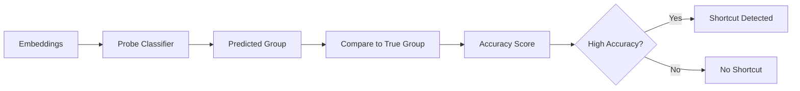

# Probe-based Detection

**Probe-based detection** tests whether protected group information can be predicted from embeddings. If a simple classifier can accurately predict group membership, the embeddings contain shortcut information.

## How It Works

1. **Train a probe classifier** on embeddings to predict protected attributes
2. **Evaluate accuracy** on held-out data
3. **High accuracy** indicates information leakage (shortcuts)



## Basic Usage

### Using SKLearnProbe

```python
from shortcut_detect import SKLearnProbe
from sklearn.linear_model import LogisticRegression
from sklearn.model_selection import train_test_split

# Split data
X_train, X_test, y_train, y_test = train_test_split(
    embeddings, group_labels, test_size=0.2, random_state=42
)

# Create and train probe
probe = SKLearnProbe(LogisticRegression(max_iter=1000))
probe.fit(X_train, y_train)

# Evaluate
accuracy = probe.score(X_test, y_test)
print(f"Probe accuracy: {accuracy:.2%}")

if accuracy > 0.7:
    print("HIGH RISK: Shortcuts detected!")
elif accuracy > 0.6:
    print("MEDIUM RISK: Some shortcuts present")
else:
    print("LOW RISK: Minimal shortcuts")
```

### Using TorchProbe

For GPU acceleration or custom architectures:

```python
from shortcut_detect import TorchProbe
import torch.nn as nn

# Define custom architecture
class MLPProbe(nn.Module):
    def __init__(self, input_dim, n_classes):
        super().__init__()
        self.layers = nn.Sequential(
            nn.Linear(input_dim, 256),
            nn.ReLU(),
            nn.Dropout(0.3),
            nn.Linear(256, n_classes)
        )

    def forward(self, x):
        return self.layers(x)

# Create probe
probe = TorchProbe(
    model=MLPProbe(512, 3),  # 512-dim embeddings, 3 groups
    device='cuda',
    epochs=50,
    learning_rate=1e-3
)

probe.fit(X_train, y_train)
accuracy = probe.score(X_test, y_test)
```

### Advanced: Externalize Torch DataLoader Behavior

`TorchProbe` keeps internal loaders by default, but you can inject a loader factory and stage-specific overrides.

```python
import torch
import torch.nn as nn
from torch.utils.data import DataLoader

def probe_loader_factory(req):
    # req.stage in {"train", "val", "eval", "predict"}
    return DataLoader(
        req.dataset,
        batch_size=req.batch_size,
        shuffle=req.shuffle,
        num_workers=req.num_workers,
        pin_memory=req.pin_memory,
        drop_last=req.drop_last,
        **req.extra_kwargs,
    )

probe = TorchProbe(
    model=MLPProbe(512, 3),
    loss_fn=nn.CrossEntropyLoss(),
    loader_factory=probe_loader_factory,
    stage_loader_overrides={"predict": {"batch_size": 16}},
)
```

### Advanced: File-Backed Datasets (Large Data)

Use `fit_dataset(...)` to train from map-style or iterable datasets without loading everything into RAM.

```python
import torch
import torch.nn as nn
from shortcut_detect.probes import TorchProbe

class EmbeddingDataset(torch.utils.data.Dataset):
    def __init__(self, rows):
        self.rows = rows  # file index / metadata

    def __len__(self):
        return len(self.rows)

    def __getitem__(self, idx):
        # Load one sample from disk here.
        x = load_embedding_from_file(self.rows[idx])   # shape (d,)
        y = load_group_label(self.rows[idx])           # int class id
        return {"embeddings": x, "labels": y}

probe = TorchProbe(
    model=nn.Linear(512, 2),
    loss_fn=nn.CrossEntropyLoss(),
    metric="accuracy",
    device="cpu",
)
probe.fit_dataset(EmbeddingDataset(index_rows))
```

## Parameters

### SKLearnProbe

| Parameter | Type | Default | Description |
|-----------|------|---------|-------------|
| `classifier` | sklearn estimator | LogisticRegression | Any sklearn classifier |
| `cv` | int | 5 | Cross-validation folds |

### TorchProbe

| Parameter | Type | Default | Description |
|-----------|------|---------|-------------|
| `model` | nn.Module | MLP | PyTorch model |
| `device` | str | 'cpu' | Device for training |
| `epochs` | int | 100 | Training epochs |
| `learning_rate` | float | 1e-3 | Optimizer learning rate |
| `batch_size` | int | 64 | Training batch size |

## Outputs

### Attributes

| Attribute | Type | Description |
|-----------|------|-------------|
| `accuracy_` | float | Test set accuracy |
| `cv_scores_` | ndarray | Cross-validation scores |
| `predictions_` | ndarray | Predicted labels |
| `probabilities_` | ndarray | Class probabilities |
| `feature_importances_` | ndarray | Feature importance (if available) |

### Interpretation

| Accuracy | Risk Level | Interpretation |
|----------|------------|----------------|
| < 55% | Low | Near random, minimal shortcuts |
| 55-70% | Medium | Some information leakage |
| 70-85% | High | Significant shortcuts |
| > 85% | Very High | Severe shortcuts |

!!! warning "Baseline Correction"
    For imbalanced groups, compare to the majority class baseline:
    ```python
    baseline = max(np.bincount(y_test)) / len(y_test)
    corrected_accuracy = (accuracy - baseline) / (1 - baseline)
    ```

## Classifier Comparison

Different classifiers can reveal different types of shortcuts:

```python
from sklearn.linear_model import LogisticRegression
from sklearn.svm import SVC
from sklearn.ensemble import RandomForestClassifier

classifiers = {
    'Logistic Regression': LogisticRegression(max_iter=1000),
    'Linear SVM': SVC(kernel='linear'),
    'RBF SVM': SVC(kernel='rbf'),
    'Random Forest': RandomForestClassifier(n_estimators=100),
}

results = {}
for name, clf in classifiers.items():
    probe = SKLearnProbe(clf)
    probe.fit(X_train, y_train)
    results[name] = probe.score(X_test, y_test)
    print(f"{name}: {results[name]:.2%}")
```

| Classifier | Best For |
|------------|----------|
| Logistic Regression | Linear shortcuts |
| Linear SVM | Margin-based linear separation |
| RBF SVM | Non-linear shortcuts |
| Random Forest | Complex, non-linear patterns |

## Feature Importance

Identify which embedding dimensions contribute most to shortcuts:

```python
from sklearn.linear_model import LogisticRegression

probe = SKLearnProbe(LogisticRegression(max_iter=1000))
probe.fit(X_train, y_train)

# Get feature importance (absolute coefficients)
importance = np.abs(probe.classifier.coef_).mean(axis=0)
top_features = np.argsort(importance)[-10:]

print("Top 10 shortcut dimensions:", top_features)
```

## Cross-Validation

For more robust estimates:

```python
from sklearn.model_selection import cross_val_score

probe = SKLearnProbe(LogisticRegression(max_iter=1000))
scores = cross_val_score(
    probe.classifier,
    embeddings,
    group_labels,
    cv=5
)

print(f"CV Accuracy: {scores.mean():.2%} (+/- {scores.std():.2%})")
```

## When to Use Probes

**Use probes when:**

- You want a direct measure of information leakage
- You need interpretable feature importance
- Your embeddings have many dimensions
- You want to compare linear vs. non-linear shortcuts

**Don't use probes when:**

- You have very few samples (< 100)
- Groups are highly imbalanced
- You want unsupervised analysis

## Theory

Probe-based detection is based on **information theory**. If group labels $G$ can be predicted from embeddings $E$, then:

$$I(E; G) > 0$$

Where $I(E; G)$ is the mutual information between embeddings and group labels.

Probe accuracy is a lower bound on this mutual information:

$$\text{Accuracy} \approx \exp(I(E; G))$$

## See Also

- [Statistical Testing](statistical.md) - Feature-wise analysis
- [API Reference](../api/probes.md) - Full API documentation
- [Overview](overview.md) - Compare all methods
