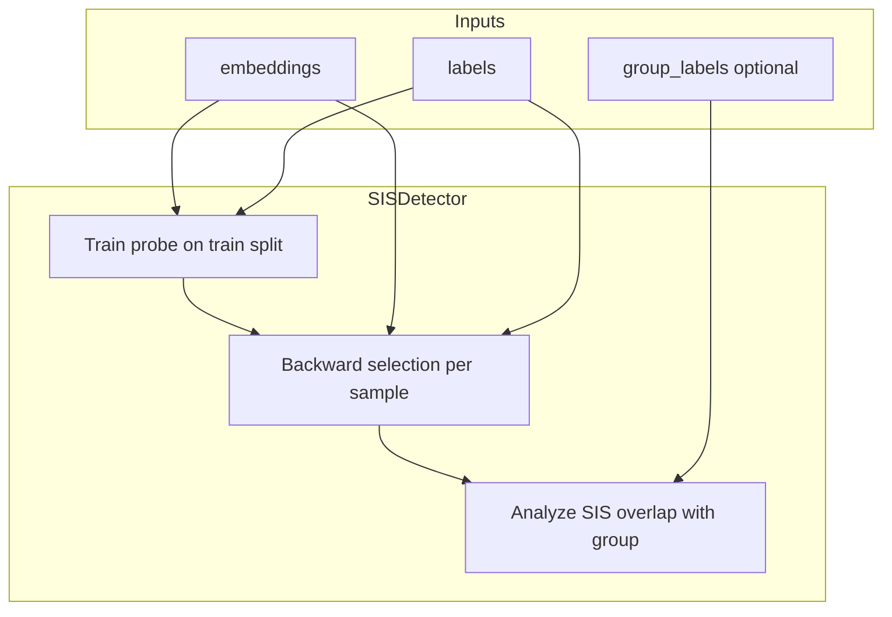

# SIS (Sufficient Input Subsets)

**Sufficient Input Subsets (SIS)** finds **minimal subsets of embedding dimensions** whose values alone suffice for a black-box predictor to make the same prediction, even when all other dimensions are masked (Carter et al. 2019).

For shortcut detection, small mean SIS size indicates the model may rely on **few dimensions** to predict—a potential shortcut. If those dimensions overlap with group-discriminative dimensions, the shortcut signal is stronger.

---

## How It Works

SIS uses **instance-wise backward selection**:

1. **Train a probe** (LogisticRegression) on embeddings → labels
2. **For each test sample**: start with full embedding; iteratively mask (zero-out) dimensions in order of least importance (ascending |coef|)
3. **Predict** on masked input; if prediction unchanged, keep dimension removed
4. **Report** minimal sufficient subset (SIS) per sample



**Shortcut signal**: Small mean SIS size (e.g., &lt; 15% of dimensions) or high overlap between SIS dimensions and group-discriminative dimensions.

---

## Basic Usage

### Via the Unified API (Recommended)

```python
from shortcut_detect import ShortcutDetector
import numpy as np

embeddings = np.load("embeddings.npy")
labels = np.load("labels.npy")
group_labels = np.load("groups.npy")  # optional, for group-SIS overlap

detector = ShortcutDetector(methods=["sis"])
detector.fit(embeddings, labels, group_labels=group_labels)

print(detector.summary())
print(detector.results_["sis"]["metrics"]["mean_sis_size"])
```

### Standalone Usage

```python
from shortcut_detect.xai import SISDetector

detector = SISDetector(
    mask_value=0.0,           # value for masked dimensions
    max_samples=200,         # cap samples for SIS computation
    test_size=0.2,           # train/test split
    shortcut_threshold=0.15,  # frac_dim <= this → shortcut signal
    seed=42,
)
detector.fit(embeddings, labels, group_labels=groups)

metrics = detector.results_["metrics"]
print(metrics["mean_sis_size"], metrics["frac_dimensions"])
print(detector.sis_sizes_)  # per-sample SIS sizes
```

---

## Parameters

| Parameter | Default | Description |
|-----------|---------|-------------|
| `mask_value` | 0.0 | Value used when ablating a dimension |
| `max_samples` | 200 | Max test samples for SIS (for performance) |
| `test_size` | 0.2 | Fraction for train/test split |
| `shortcut_threshold` | 0.15 | If `frac_dimensions` ≤ this → shortcut signal |
| `seed` | 42 | Random seed |

---

## Interpretation

| Metric | Interpretation |
|--------|----------------|
| **Mean SIS size** | Average number of dimensions sufficient for prediction (smaller = fewer dims used) |
| **Fraction of dimensions** | Mean SIS / n_dim (small = potential shortcut) |
| **Group-SIS overlap** | If group_labels provided: fraction of SIS dims that are group-discriminative (high = shortcut correlates with group) |

---

## Reference

Carter, B., Mueller, J., Jain, S., & Gifford, D. (2019). *What made you do this? Understanding black-box decisions with sufficient input subsets.* Proceedings of the Twenty-Second International Conference on Artificial Intelligence and Statistics (AISTATS), PMLR 89:567–576.
