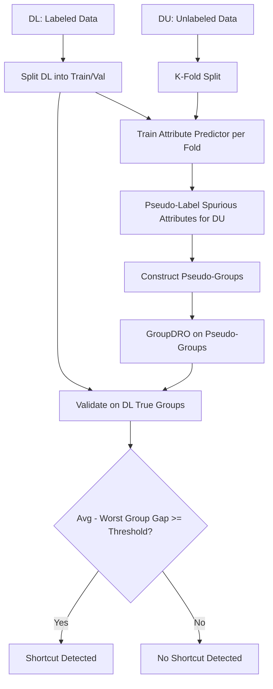

# SSA (Spread Spurious Attribute) Detector

**SSA** is a semi-supervised shortcut detection method that pseudo-labels spurious attributes for unlabeled data using a small labeled set, then applies GroupDRO to detect shortcut reliance. It is designed for settings where only a fraction of the data has group annotations.

## How It Works

SSA operates in two phases:

### Phase 1: Pseudo-Labeling (Algorithm 1)

1. **Split** labeled data (DL) into train and validation halves
2. **K-fold split** unlabeled data (DU) into K folds
3. For each fold k:
    - Train an attribute predictor on DL-train + remaining DU folds with adaptive thresholds
    - Predict pseudo spurious-attribute labels for fold k
4. **Adaptive thresholds** (Eq. 5-8) balance pseudo-label counts across groups

### Phase 2: GroupDRO Detection

5. **Construct pseudo-groups** as (label, pseudo-attribute) pairs
6. **Run GroupDRO** on DU with pseudo-groups, validated on DL (true groups)
7. **Detect shortcut** if the average-to-worst-group accuracy gap exceeds a threshold



## Basic Usage

```python
from shortcut_detect.ssa import SSADetector, SSAConfig

config = SSAConfig(
    K=3,
    T=2000,
    tau_gmin=0.95,
    seed=42,
)

detector = SSADetector(config=config)
detector.fit(
    du_embeddings=unlabeled_embeddings,
    du_labels=unlabeled_labels,
    dl_embeddings=labeled_embeddings,
    dl_labels=labeled_labels,
    dl_spurious=labeled_spurious_attrs,
)

report = detector.get_report()
print(f"Shortcut detected: {report['shortcut_detected']}")
print(f"Risk level: {report['risk_level']}")
print(f"Avg accuracy: {report['metrics']['avg_acc']:.3f}")
print(f"Worst group accuracy: {report['metrics']['worst_group_acc']:.3f}")
print(f"Gap: {report['metrics']['gap']:.3f}")
```

## Parameters (SSAConfig)

| Parameter | Type | Default | Description |
|-----------|------|---------|-------------|
| `K` | int | 3 | Number of K-fold splits for pseudo-labeling |
| `T` | int | 2000 | Training iterations per fold |
| `batch_size` | int | 128 | Batch size for training |
| `lr` | float | 1e-3 | Learning rate for SGD |
| `weight_decay` | float | 1e-4 | Weight decay for SGD |
| `momentum` | float | 0.9 | SGD momentum |
| `hidden_dim` | int or None | None | Hidden layer size for attribute predictor (None = linear) |
| `dropout` | float | 0.0 | Dropout rate for attribute predictor |
| `tau_gmin` | float | 0.95 | Confidence threshold for the smallest group |
| `threshold_update_every` | int | 200 | How often to update adaptive thresholds |
| `dl_val_fraction` | float | 0.5 | Fraction of DL used for validation |
| `seed` | int | 0 | Random seed |
| `device` | str or None | None | PyTorch device (auto-detected if None) |
| `groupdro` | GroupDROConfig | default | Configuration for the Phase 2 GroupDRO |
| `ssa_gap_threshold` | float | 0.10 | Accuracy gap threshold for shortcut detection |

## Outputs

### Report Structure

| Field | Type | Description |
|-------|------|-------------|
| `shortcut_detected` | bool or None | Whether the accuracy gap exceeds the threshold |
| `risk_level` | str | "low", "moderate", or "unknown" |
| `metrics.n_labeled` | int | Number of labeled (DL) samples |
| `metrics.n_unlabeled` | int | Number of unlabeled (DU) samples |
| `metrics.avg_acc` | float | Average accuracy from GroupDRO |
| `metrics.worst_group_acc` | float | Worst-group accuracy from GroupDRO |
| `metrics.gap` | float | Average minus worst-group accuracy |

### Interpretation

| Risk Level | Condition |
|------------|-----------|
| **Low** | Accuracy gap < threshold (no shortcut detected) |
| **Moderate** | Accuracy gap >= threshold (shortcut detected) |
| **Unknown** | Insufficient data or non-finite metrics |

## When to Use

**Use SSA when:**

- You have a small set of group-labeled data and a larger unlabeled set
- You suspect spurious correlations but lack complete group annotations
- You want to leverage semi-supervised learning for shortcut detection
- Your data has both task labels and (partial) spurious attribute labels

**Don't use SSA when:**

- You have complete group labels for all data (use GroupDRO directly)
- You have no group labels at all (use GCE or Probe-based detection)
- Your dataset is very small (SSA needs enough data for K-fold splitting)
- You cannot use PyTorch (SSA requires torch for training)

## Theory

SSA (Spread Spurious Attribute) addresses the realistic scenario where group annotations are expensive and only available for a small subset. The key insight is that a pseudo-labeler trained on a mix of labeled and high-confidence unlabeled data can propagate spurious attribute labels to the full dataset.

**Adaptive thresholds** (Eq. 5-8) ensure balanced pseudo-label counts across groups by setting per-group confidence thresholds relative to the smallest group:

$$g_{\min} = \arg\min_g |D_L^{\circ}(g)|$$

The threshold for each group is chosen so that the total (labeled + pseudo-labeled) count per group does not exceed a cap derived from $g_{\min}$.

After pseudo-labeling, **GroupDRO** optimizes worst-group performance. A large gap between average and worst-group accuracy indicates that the model relies on spurious correlations (shortcuts).

## See Also

- [GroupDRO](groupdro.md) - The robust training method used in Phase 2
- [Demographic Parity](demographic-parity.md) - Group-level fairness metric
- [API Reference](../api/ssa.md) - Full API documentation
- [Overview](overview.md) - Compare all methods
