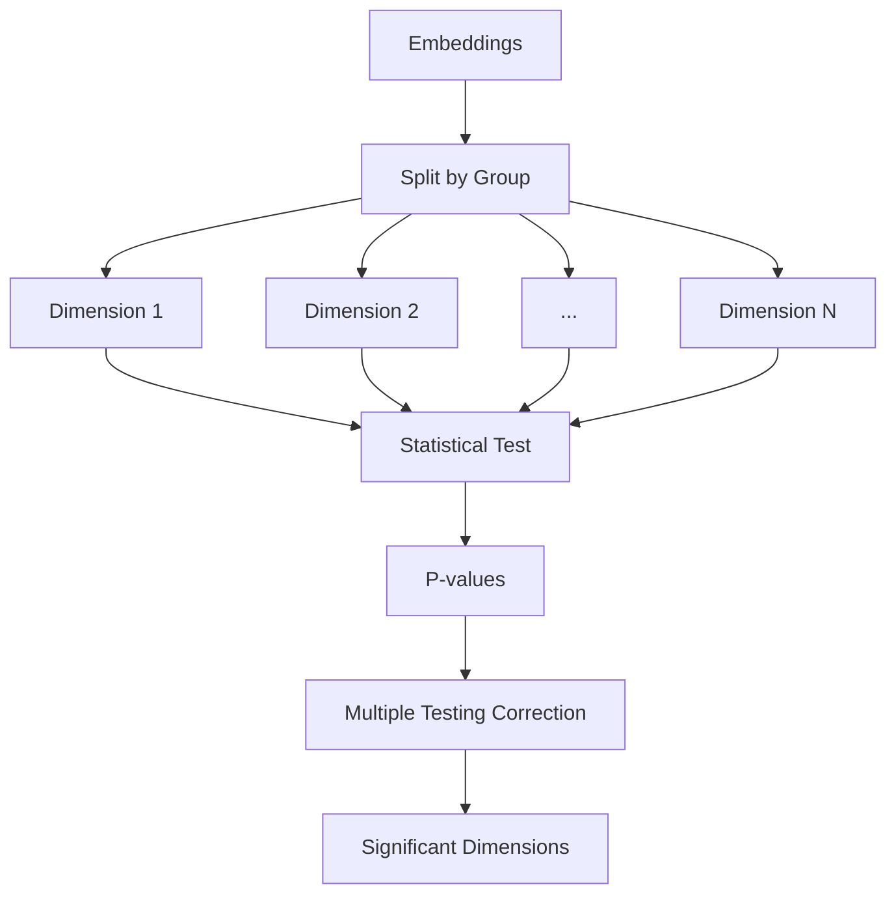

# Statistical Testing

**Statistical testing** identifies specific embedding dimensions where protected groups differ significantly. This method pinpoints exactly which features encode shortcut information.

## How It Works

1. **For each embedding dimension**, compare distributions between groups
2. **Apply statistical tests** (e.g., Mann-Whitney U, t-test)
3. **Correct for multiple testing** (Benjamini-Hochberg)
4. **Report significant dimensions** as potential shortcuts



## Basic Usage

```python
from shortcut_detect import GroupDiffTest
from scipy.stats import mannwhitneyu

# Create test
test = GroupDiffTest(test=mannwhitneyu)

# Fit on embeddings and group labels
test.fit(embeddings, group_labels)

# Access results
print(f"Significant features: {test.n_significant_}")
print(f"Feature indices: {test.significant_features_}")
print(f"P-values: {test.pvalues_}")
```

## Parameters

| Parameter | Type | Default | Description |
|-----------|------|---------|-------------|
| `test` | callable | `mannwhitneyu` | Statistical test function |
| `alpha` | float | 0.05 | Significance level |
| `correction` | str | 'fdr_bh' | Multiple testing correction |
| `alternative` | str | 'two-sided' | Alternative hypothesis |

## Available Tests

### Non-parametric Tests

```python
from scipy.stats import mannwhitneyu, kruskal

# Mann-Whitney U (2 groups, recommended)
test = GroupDiffTest(test=mannwhitneyu)

# Kruskal-Wallis (3+ groups)
test = GroupDiffTest(test=kruskal)
```

### Parametric Tests

```python
from scipy.stats import ttest_ind, f_oneway

# Independent t-test (2 groups, assumes normality)
test = GroupDiffTest(test=ttest_ind)

# One-way ANOVA (3+ groups)
test = GroupDiffTest(test=f_oneway)
```

### Test Selection Guide

| Condition | Recommended Test |
|-----------|-----------------|
| 2 groups, non-normal | Mann-Whitney U |
| 2 groups, normal | Independent t-test |
| 3+ groups, non-normal | Kruskal-Wallis |
| 3+ groups, normal | One-way ANOVA |

## Multiple Testing Correction

When testing many dimensions, correct for multiple comparisons:

```python
# Benjamini-Hochberg FDR (recommended)
test = GroupDiffTest(correction='fdr_bh')

# Bonferroni (conservative)
test = GroupDiffTest(correction='bonferroni')

# Holm-Bonferroni (less conservative)
test = GroupDiffTest(correction='holm')

# No correction (not recommended)
test = GroupDiffTest(correction=None)
```

| Correction | Strictness | False Positives |
|------------|-----------|-----------------|
| Bonferroni | Very strict | Very low |
| Holm | Strict | Low |
| FDR (BH) | Moderate | Controlled at alpha |
| None | Lenient | High |

## Outputs

### Attributes

| Attribute | Type | Description |
|-----------|------|-------------|
| `pvalues_` | ndarray | Raw p-values per dimension |
| `pvalues_corrected_` | ndarray | Corrected p-values |
| `significant_features_` | ndarray | Indices of significant features |
| `n_significant_` | int | Number of significant features |
| `effect_sizes_` | ndarray | Effect sizes per dimension |

### Interpretation

| % Significant Features | Risk Level | Interpretation |
|----------------------|------------|----------------|
| < 5% | Low | Few dimensions encode group info |
| 5-20% | Medium | Some dimensions biased |
| 20-50% | High | Many dimensions biased |
| > 50% | Very High | Embeddings dominated by shortcuts |

## Visualization

### Volcano Plot

```python
import matplotlib.pyplot as plt
import numpy as np

# Create volcano plot
fig, ax = plt.subplots(figsize=(10, 6))

# -log10(p-value) vs effect size
x = test.effect_sizes_
y = -np.log10(test.pvalues_corrected_ + 1e-300)

# Color significant points
colors = ['red' if i in test.significant_features_ else 'gray'
          for i in range(len(x))]

ax.scatter(x, y, c=colors, alpha=0.5)
ax.axhline(-np.log10(0.05), color='blue', linestyle='--', label='p=0.05')
ax.set_xlabel('Effect Size')
ax.set_ylabel('-log10(p-value)')
ax.set_title('Volcano Plot: Statistical Testing')
ax.legend()
plt.tight_layout()
plt.savefig('volcano_plot.png')
```

### Feature Importance Bar Plot

```python
# Top 20 most significant features
top_indices = test.significant_features_[:20]
top_pvalues = test.pvalues_corrected_[top_indices]

fig, ax = plt.subplots(figsize=(10, 6))
ax.barh(range(len(top_indices)), -np.log10(top_pvalues))
ax.set_yticks(range(len(top_indices)))
ax.set_yticklabels([f'Dim {i}' for i in top_indices])
ax.set_xlabel('-log10(p-value)')
ax.set_title('Top 20 Significant Dimensions')
plt.tight_layout()
plt.savefig('significant_features.png')
```

## Effect Size Calculation

Beyond p-values, effect sizes quantify the magnitude of differences:

```python
# Cohen's d for effect size
def cohens_d(group1, group2):
    n1, n2 = len(group1), len(group2)
    var1, var2 = group1.var(), group2.var()
    pooled_std = np.sqrt(((n1-1)*var1 + (n2-1)*var2) / (n1+n2-2))
    return (group1.mean() - group2.mean()) / pooled_std

# Calculate for each dimension
effect_sizes = []
for dim in range(embeddings.shape[1]):
    g1 = embeddings[group_labels == 0, dim]
    g2 = embeddings[group_labels == 1, dim]
    effect_sizes.append(cohens_d(g1, g2))
```

| Effect Size (|d|) | Interpretation |
|------------------|----------------|
| < 0.2 | Small |
| 0.2 - 0.5 | Medium |
| 0.5 - 0.8 | Large |
| > 0.8 | Very large |

## Multi-group Analysis

For more than 2 groups:

```python
from scipy.stats import kruskal

# Kruskal-Wallis test
test = GroupDiffTest(test=kruskal)
test.fit(embeddings, group_labels)  # group_labels can be 0, 1, 2, ...

# Post-hoc pairwise comparisons
from scipy.stats import mannwhitneyu
from itertools import combinations

groups = np.unique(group_labels)
for g1, g2 in combinations(groups, 2):
    mask1 = group_labels == g1
    mask2 = group_labels == g2
    pairwise_test = GroupDiffTest(test=mannwhitneyu)
    pairwise_test.fit(
        np.vstack([embeddings[mask1], embeddings[mask2]]),
        np.concatenate([np.zeros(mask1.sum()), np.ones(mask2.sum())])
    )
    print(f"Groups {g1} vs {g2}: {pairwise_test.n_significant_} significant dims")
```

## When to Use Statistical Testing

**Use statistical testing when:**

- You want to identify specific biased dimensions
- You need interpretable, dimension-level results
- Your embeddings are high-dimensional
- You want to quantify effect sizes

**Don't use statistical testing when:**

- Biases are non-linear or interaction-based
- You have very few samples per group
- You only care about aggregate shortcut presence

## Theory

Statistical testing is based on **hypothesis testing**:

- **Null hypothesis ($H_0$)**: Dimension $d$ has the same distribution across groups
- **Alternative ($H_1$)**: Distributions differ

For each dimension:

$$p_d = P(\text{observed difference} | H_0)$$

Multiple testing correction controls the False Discovery Rate (FDR):

$$\text{FDR} = E\left[\frac{\text{False Positives}}{\text{Total Rejections}}\right] \leq \alpha$$

## See Also

- [HBAC Clustering](hbac.md) - Aggregate shortcut detection
- [API Reference](../api/statistical.md) - Full API documentation
- [Overview](overview.md) - Compare all methods
